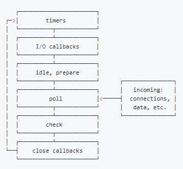

#    前端面试

## 浏览器工作原理

https://juejin.cn/post/6844903553795014663 从浏览器多进程到JS单线程，JS运行机制最全面的一次梳理

https://xie.infoq.cn/article/5d36d123bfd1c56688e125ad3 Chrome 浏览器架构

#### 浏览器接收到HTML文件并转换为DOM树

字节数据 => 字符串 => Token => Node => DOM

Node 会根据不同 Node 之前的联系构建为一颗 DOM 树。

#### 将 CSS 文件转换为 CSSOM 树

字节数据 => 字符串 => Token => Node => CSSOM

#### 合成线程

##### 合成线程对事件的处理

由于运行 Javascript 是主线程的工作，当页面被合成线程合成过，合成线程会标记那些有事件监听的区域。有了这些信息，当事件发生在响应的区域时，合成线程就会将事件发送给主线程处理。如果在非事件监听区域，则渲染进程直接创建新的帧而不关心主线程。

当渲染线程将事件发送给主线程后，第一件事就是找到事件触发的目标。通过在渲染过程中生成的绘制信息，可以根据坐标找到目标元素。


### 安全防范知识

#### XSS

通常可以通过两种方式来开启 CSP：

1. 设置 HTTP Header 中的 `Content-Security-Policy`
2. 设置 `meta` 标签的方式 `<meta http-equiv="Content-Security-Policy">`

#### CSRF 跨站请求伪造 

原理就是攻击者构造出一个后端请求地址，诱导用户点击或者通过某些途径自动发起请求。如果用户是在登录状态下的话，后端就以为是用户在操作，从而进行相应的逻辑。

防范 CSRF 攻击可以遵循以下几种规则：

1. Get 请求不对数据进行修改
2. 不让第三方网站访问到用户 Cookie
3. 阻止第三方网站请求接口
4. 请求时附带验证信息，比如验证码或者 Token

#### 点击劫持

点击劫持是一种视觉欺骗的攻击手段。攻击者将需要攻击的网站通过 `iframe` 嵌套的方式嵌入自己的网页中，并将 `iframe` 设置为透明，在页面中透出一个按钮诱导用户点击。

推荐防御的方法有两种

+ X-FRAME-OPTIONS

  `X-FRAME-OPTIONS` 是一个 HTTP 响应头，在现代浏览器有一个很好的支持。这个 HTTP 响应头 就是为了防御用 `iframe` 嵌套的点击劫持攻击

  该响应头有三个值可选，分别是

  - `DENY`，表示页面不允许通过 `iframe` 的方式展示
  - `SAMEORIGIN`，表示页面可以在相同域名下通过 `iframe` 的方式展示
  - `ALLOW-FROM`，表示页面可以在指定来源的 `iframe` 中展示

+ JS防御

#### 中间人攻击

## CSS

#### line-clamp控制文本行数

**限制在一个块元素显示的文本的行数。**

-webkit-line-clamp 是一个 不规范的属性（unsupported WebKit property），它没有出现在 CSS 规范草案中。

为了实现该效果，它需要组合其他外来的WebKit属性。常见结合属性：

- display: -webkit-box; 必须结合的属性 ，将对象作为弹性伸缩盒子模型显示 。
- -webkit-box-orient 必须结合的属性 ，设置或检索伸缩盒对象的子元素的排列方式 。
- text-overflow，可以用来多行文本的情况下，用省略号“...”隐藏超出范围的文本 。

```css
.line-clamp {
                 display: -webkit-box;
                 -webkit-box-orient: vertical;
                 -webkit-line-clamp: 4;            /*设置p元素最大4行，父元素需填写宽度才明显*/
                 text-overflow: ellipsis;
                 overflow: hidden;
                 /* autoprefixer: off */
                 -webkit-box-orient: vertical;
                  /* autoprefixer: on */
                  /*因为代码环境的关系-webkit-box-orient被过滤掉了 autoprefixer 这个关键字可以免除被过滤的动作*/
　　　　　　　　　　word-wrap:break-word;
　　　　　　　　　　word-break:break-all;
}
```

如果你标签内的是英文，英文是不会自动换行的，所以你需要让他自动换行添加如下代码即可：

```css
word-wrap:break-word;
word-break:break-all;
```


#### box-sizing

box-sizing 属性可以被用来调整这些表现:

- `content-box` 是默认值。如果你设置一个元素的宽为100px，那么这个元素的内容区会有100px 宽，并且任何边框和内边距的宽度都会被增加到最后绘制出来的元素宽度中。
- `border-box` 告诉浏览器：你想要设置的边框和内边距的值是包含在width内的。也就是说，如果你将一个元素的width设为100px，那么这100px会包含它的border和padding，内容区的实际宽度是width减去(border + padding)的值。大多数情况下，这使得我们更容易地设定一个元素的宽高。

#### BFC

##### 什么是BFC

(*Block Formatting Context*)块级格式化上下文


BFC是CSS中的一个渲染机制，就是一个作用范围，把它理解成是一个独立的容器，并且这个容器里box的布局与这个容器外的box毫不相干。

简单来说，BFC 实际上是一块区域，在这块区域中遵循一定的规则，有一套独特的渲染规则。


##### 触发BFC的条件

+ 根元素或其它包含它的元素

+ 浮动元素 (元素的 `float` 不是 `none`)

+ 绝对定位元素 (元素具有 `position` 为 `absolute` 或 `fixed`)

+ 内联块 (元素具有 `display: inline-block`)

+ 表格单元格 (元素具有 `display: table-cell`，HTML表格单元格默认属性)

+ 表格标题 (元素具有 `display: table-caption`, HTML表格标题默认属性)

+ 具有`overflow` 且值不是 `visible` 的块元素

+ 弹性盒（`flex`或`inline-flex`）
+ display: flow-root
+ column-span: all

##### BFC的约束规则

+ 内部的盒会在垂直方向一个接一个排列（可以看作BFC中有一个的常规流）

+ 处于同一个BFC中的元素相互影响，可能会发生外边距重叠

+ 每个元素的margin box的左边，与容器块border box的左边相接触(对于从左往右的格式化，否则相反)，即使存在浮动也是如此

+ BFC就是页面上的一个隔离的独立容器，容器里面的子元素不会影响到外面的元素，反之亦然

+ 计算BFC的高度时，考虑BFC所包含的所有元素，连浮动元素也参与计算

+ 浮动盒区域不叠加到BFC上

#####  BFC可以解决的问题

- 垂直外边距重叠问题，父元素设置overflow: hidden

  会有哪些现象 https://www.w3.org/TR/CSS2/box.html#collapsing-margins

- 去除浮动：父元素设置overflow: hidden触发BFC实现清除浮动，防止父元素高度塌陷，后面的元素被覆盖，实现文字环绕等等。

- 自适用两列布局（`float` + `overflow`）

MDN的解释  https://developer.mozilla.org/zh-CN/docs/Web/Guide/CSS/Block_formatting_context

#### margin 等高布局

##### 滚动容器底部留白

如果容器可以滚动，在IE和Firefox浏览器下是会忽略padding-bottom值的，Chrome则不会

滚动容器底部留白使用padding是不推荐的，因为兼容性是个大问题，但是可以借助margin的外部尺寸特性来实现底部留白

```html
<div style="height: 200px;">
  
</div>
```

##### margin负值实现等高

```css
.column-box {
  overflow: hidden;
}
.column-left,
.column-right {
  margin-bottom: -9999px;
  padding-bottom: 9999px;
}
```

垂直方向margin 无法改变元素的内部尺寸，但却能改变外部尺寸，这里设置了margin-bottom:-9999px 意味着元素的外部尺寸在垂直方向上小了9999px;默认情况下，垂直方向块级元素上下距离是0，一旦margin-bottom:-9999px就以为这后面所有元素和上面元素的空间距离编程了-9999px，也就是后面元素都往上移动了9999px,此时，通过神来一笔padding-bottom: 9999px增加元素高度，正负抵消


##### border实现等高

```html
<div class="box">
  <nav></nav>
  <section></section>
</div>
```

```css
.box {
  border-left: 150px solid #333;
}
.box:after {
  content: '';
  display: block;
  clear: both;
}
.box > nav {
  width: 150px;
  margin-left: -150px;
  float: left;
}
.box > section {
  overflow: hidden;
}
```

元素边框高度总是和元素自身高度保持一致

局限性：

+ 由于border不支持百分比宽度，因此，适合至少一栏是定宽的布局
+ 等高布局的栏目有限制，以为一个元素的边框数目是有限的，基本上，border等高布局只能满足2-3栏的情况

#### width: auto和100%区别


##### width:auto

width:auto表示宽度是可变动的，这个div的所有部（content+margin+padding+border）相加为父元素的width大小，。

width:100%子元素的width值为父元素的width值，加margin时不改变子元素width值大小，而是溢出父元素。

+ 充分利用可用空间
+ 收缩和包裹 收缩到合适
+ 收缩到最小
+ 超出容器限制

##### 流提特性

+ 正常流宽度

  当在一个容器里倒入足量的水时，水一定会均匀铺满整个容器

  所谓流动性，并不是看上去的宽度100%显示这么简单，而是一种margin/border/padding和content内容区域自动分配水平空间的机制

+ 格式化宽度

  仅出现在“绝对定位模型”

  在默认情况下，绝对定位元素的宽度表现是"包裹性"，宽度由内部尺寸决定，但是，有一种情况其宽度由外部尺寸决定的-->

  对于非替换元素，当left/right或top/bottom对应方位的属性值同时存在的时候，元素的宽度表现为"格式化宽度”，

  其宽度大小相对于最近的具有定位特性的祖先元素计算

+ 实现文字少的时候居中显示，文字超过一行居左显示

  ```js
  .box {
    text-align: center;
  }
  .content {
    display: inline-block;
    text-align: left;
  }
  ```

  


#### flex

##### 基本概念

1. 容器&项目：采用 Flex 布局的元素，称为 Flex 容器（flex container），简称"容器"。它的所有子元素自动成为容器成员，称为 Flex 项目（flex item），简称"项目"。
2. 主轴&交叉轴：堆叠的方向，默认主轴是水平方向，交叉轴是垂直方向。可通过`flex-derection: column`设置主轴为垂直方向。

**容器属性：**

- display: flex
- flex-direction：主轴的方向（即项目的排列方向），row | row-reverse | column | column-reverse;
- flex-wrap：是否换行，nowrap | wrap | wrap-reverse;
- flex-flow：direction 和 wrap简写
- justify-content：主轴对齐方式，flex-start | flex-end | center | space-between | space-around;
- align-items：交叉轴对齐方式，flex-start | flex-end | center | baseline | stretch;
- align-content: 多根轴线的对齐方式。如果项目只有一根轴线，该属性不起作用。flex-start | flex-end | center | space-between | space-around | stretch;

**项目的属性:**

- order：项目的排列顺序，数值越小，排列越靠前，默认为0。
- flex-grow：放大比例，默认为0，指定元素分到的剩余空间的比例。
- flex-shrink：缩小比例，默认为1，指定元素分到的缩减空间的比例。
- flex-basis：分配多余空间之前，项目占据的主轴空间，默认值为auto
- flex：grow, shrink 和 basis的简写，默认值为0 1 auto
- align-self：单个项目不一样的对齐方式，默认值为auto，auto | flex-start | flex-end | center | baseline | stretch;


##### flex 是什么属性的缩写：

flex属性是 `flex-grow`、`flex-shrink` 和 `flex-basis` 的简写

##### flex-basis

MDN定义: 指定了flex 元素在主轴方向上的初始大小；

max-width min-width width box大小优先级是怎么样

max-width/min-width > flex-basis > width > box

#### 如何实现居中

##### 水平居中

+ 行内元素，给其父元素设置`text-align:center`

+ 块级元素，`margin: 0 auto` (元素需要定宽)

+ 若是块级元素，设置父元素为flex布局，子元素设置`margin:0 auto`即可（子元素不需要定宽）

+ `flex`布局

+ `transform`
	
	

##### 垂直居中

+ 元素是单行文本，则设置 `line-height`等于父元素高度

+ 元素是行内块元素，`display: incline-block,vertival-align: middle` 加一个伪元素

  扩展： css伪元素和一般dom是什么关系

  [CSS：使用伪元素做水平垂直居中的微深入研究](https://www.jianshu.com/p/b45f4d8ca372)

  Vertical-align: 该属性定义行内元素的基线相对于该元素所在行的基线的垂直对齐

+ 设置父元素`display:table`, 子元素 `display:table-cell;vertical-align:middle`

+ transform

##### CSS 怎么画一个大小为父元素宽度一半的正方形

http://www.fly63.com/article/detial/2104


```html
<!DOCTYPE html>
<html lang="en">
  <head>
    <meta charset="UTF-8" />
    <meta name="viewport" content="width=device-width, initial-scale=1.0" />
    <title>Document</title>
    <style>
      .outer {
        width: 400px;
        height: 600px;
        background: red;
      }

      .inner {
        width: 50%;
        padding-bottom: 50%;
        background: blue;
      }
    </style>
  </head>
  <body>
    <div class="outer">
      <div class="inner"></div>
    </div>
  </body>
</html>
```


#### css 之auto一切

##### width: auto

以上介绍过

##### margin: auto

> 如果`margin-left`和`margin-right`值均为`auto`，则它们的使用值相等。 这使元素相对于包含块的边缘水平居中。

具有绝对定位元素的margin: auto

item 需要满足两个条件

+ 设置宽度和高度
+ 元素应具有position:absolute;

```css
.wrapper {
    position: relative;
}

.item {
    width: 200px;
    height: 100px;
    position: absolute;
    left: 0;
    top: 0;
    right: 0;
    bottom: 0;
    margin: auto;
}
```

##### flexbox auto

`flex: auto` 等价于 `flex: 1 1 auto`

> 该项目根据其宽度和高度属性调整大小，但会增长以吸收flex容器中的任何额外自由空间，并会收缩到其最小尺寸以适合该容器，这等效于设置“ `flex：1 1 auto`”。

##### position auto

示例代码  /fangyi/learning-docs/code/interview/css-world/auto.html

```css
.wrapper {
  position: relative;
  padding: 16px;
  height: 300px;
}
.item {
  position: absolute;
  width: 100px;
  height: 100px;
}
```

子项item 绝对定位，未设定top left right bottom 默认情况下，在wrapper的padding 16px处开始定位，相当于left为16px ==> left: auto;默认位置


##### 用例和示例


```css
.tooltip:before {
  position: absolute;
  right: 100%;
}
.tooltip.to-right:before {
  position: absolute;
  right: auto;
  left: 100%;
}
```


```css
.card .icon {
  position: absolute;
  left: 15px;
  top: 15px;
}
.card.is-right .icon {
  left: auto;
  right: 15px;
}
```


```html
<div class="item">
  <div class="item-group">
    <!-- Title and description -->
  </div>
  <button class="item__action">
    Confirm
  </button>
</div>
```


```css
.item {
  display: flex;
  flex-wrap: wrap;
  justify-content: space-between;
}
.item__action {
  margin-left: auto;
}
```

就是这样，通过使用`margin-left: auto` 将动作推到最右角


#### 实现两栏布局的方式

##### 左 float，然后右 margin-left(右边自适应)

```html
<!DOCTYPE html>
<html lang="en">
  <head>
    <meta charset="UTF-8" />
    <meta name="viewport" content="width=device-width, initial-scale=1.0" />
    <title>Document</title>
    <style>
      div {
        height: 500px;
      }

      .aside {
        width: 300px;
        float: left;
        background: yellow;
      }

      .main {
        background: aqua;
        margin-left: 300px;
      }
    </style>
  </head>
  <body>
    <div class="aside"></div>
    <div class="main"></div>
  </body>
</html>
```

##### 左 float，然后右 margin-left(右边自适应)

```html
<!DOCTYPE html>
<html lang="en">
  <head>
    <meta charset="UTF-8" />
    <meta name="viewport" content="width=device-width, initial-scale=1.0" />
    <title>Document</title>
    <style>
      div {
        height: 500px;
      }

      .aside {
        width: 300px;
        float: right;
        background: yellow;
      }

      .main {
        background: aqua;
        margin-right: 300px;
      }
    </style>
  </head>
  <body>
    <div class="aside"></div>
    <div class="main"></div>
  </body>
</html>
```


##### BFC+float

```html
<!DOCTYPE html>
<html lang="en">
  <head>
    <meta charset="UTF-8" />
    <meta name="viewport" content="width=device-width, initial-scale=1.0" />
    <title>Document</title>
    <style>
      div {
        height: 500px;
      }

      .aside {
        width: 300px;
        float: left;
        background: yellow;
      }

      .main {
        overflow: hidden;
        background: aqua;
      }
    </style>
  </head>
  <body>
    <div class="aside"></div>
    <div class="main"></div>
  </body>
</html>
```


##### float+ 负 margin

```html
<head>
  <style>
    .left {
      width: 100%;
      float: left;
      background: #f00;
      margin-right: -200px;
    }

    .right {
      float: left;
      width: 200px;
      background: #0f0;
    }
  </style>
</head>

<div class="left"><p>hello</p></div>
<div class="right"><p>world</p></div>
```


#### 实现一个两栏三列的布局，并且要求三列等高，且以内容最多的一列的高度为准


#### 如何避免回流和重绘

- 重绘是当节点需要更改外观而不会影响布局的，比如改变 `color` 就叫称为重绘
- 回流是布局或者几何属性需要改变就称为回流。

重绘和回流其实也和 Eventloop 有关。

1. 当 Eventloop 执行完 Microtasks 后，会判断 `document` 是否需要更新，因为浏览器是 60Hz 的刷新率，每 16.6ms 才会更新一次。
2. 然后判断是否有 `resize` 或者 `scroll` 事件，有的话会去触发事件，所以 `resize` 和 `scroll` 事件也是至少 16ms 才会触发一次，并且自带节流功能。
3. 判断是否触发了 media query
4. 更新动画并且发送事件
5. 判断是否有全屏操作事件
6. 执行 `requestAnimationFrame` 回调
7. 执行 `IntersectionObserver` 回调，该方法用于判断元素是否可见，可以用于懒加载上，但是兼容性不好
8. 更新界面
9. 以上就是一帧中可能会做的事情。如果在一帧中有空闲时间，就会去执行 `requestIdleCallback` 回调。
10. 以上内容来自于 [HTML 文档](https://html.spec.whatwg.org/multipage/webappapis.html#event-loop-processing-model)。

CSS：

- 避免使用table布局，可能很小的一个小改动会造成整个 `table` 的重新布局。
- 尽可能在DOM树的最末端改变class。
- 避免设置多层内联样式。
- 将动画效果应用到`position`属性为`absolute`或`fixed`的元素上
- 避免使用CSS表达式（例如：`calc()`）
- CSS3硬件加速（GPU加速）
- CSS 选择符**从右往左**匹配查找，避免节点层级过多
- 动画实现的速度的选择，动画速度越快，回流次数越多，也可以选择使用 `requestAnimationFrame`
- 将频繁重绘或者回流的节点设置为图层，图层能够阻止该节点的渲染行为影响别的节点。比如对于 `video` 标签来说，浏览器会自动将该节点变为图层。设置节点为图层的方式有很多，我们可以通过以下几个常用属性可以生成新图层
  - `will-change`
  - `video`、`iframe` 标签

JavaScript：

- 避免频繁操作样式，最好一次性重写style属性，或者将样式列表定义为class并一次性更改class属性
- 避免频繁操作DOM，创建一个`documentFragment`，在它上面应用所有DOM操作，最后再把它添加到文档中
- 也可以先为元素设置`display: none`，操作结束后再把它显示出来。因为在display属性为none的元素上进行的DOM操作不会引发回流和重绘
- 避免频繁读取会引发回流/重绘的属性，如果确实需要多次使用，就用一个变量缓存起来
- 对具有复杂动画的元素使用绝对定位，使它脱离文档流，否则会引起父元素及后续元素频繁回流


#### 首屏加载优化的方案

+ Vue-Router路由懒加载
+ 使用CDN加速，将通用的库从vendor进行抽离
+ Nginx的gzip压缩
+ Vue异步组件
+ 服务端渲染SSR
+ 如果使用了一些UI库，采用按需加载
+ Webpack开启gzip压缩
+ Service Worker缓存文件处理
+ 使用link标签的rel属性设置prefetch preload

#### CSS 幽灵空白节点与解决方案

> “幽灵空白节点”是内联盒模型中非常重要的一个概念，具体指的是，在HTML5文档声明中，内联元素的所有解析和渲染表现就如同每个行框盒子的前面有一个“空白节点”一样。这个“空白节点”永远透明，不占据任何宽度，看不见也无法通过脚本获取，就好像幽灵一样，但又确确实实地存在，表现如同文本节点一样。

原因：vertical-align默认对齐方式和line-height文字的高度造成的

##### 解决方案

1. 让vertical-align失效

   图片默认是inline水平的，而vertical-align对块状水平的元素无感。因此，我们只要让图片display水平为block就可以了，我们可以直接设置display或者浮动、绝对定位等

   display: block;

2. 使用其他vertical-align值

   vertical-align:top
   vertical-align:middle
   vertical-align:bottom

3. 直接修改line-height值

   line-height: 0;

4. line-height为相对单位，font-size间接控制

   font-size: 0;

#### baseline

示例代码 css-world/vertical-middle.html

> 一个inline-block元素，如果里面没有内联元素，或者overflow不是visible,则该元素的基线就是其margin地边缘；否者其基线就是元素里面最后一行内联元素的基线

##### 解决方案

1. 在没有内联元素的地方插入&nbsp;占位
2. font-size:0;
3. line-height:0;
4. vertical-align: bottom /*top middle都可以*/

##### 基于20px图标对齐的处理技巧

```css
.icon {
  display: inline-block;
  width: 20px;
  height: 20px;
  background: url(sprite.png) no-repeat;
  white-space: nowrap;
  letter-spacing: -1em;
  text-indent: -999em;
}
.icon:before {
  content: '\3000'
}
.icon-xxx {
  background-position: 0 -20px;
}
```


## JS基础

### Async defer

如果 script 标签是由 JavaScript 代码创建的，标签的 async 属性会默认为 true。

### AMD,CMD,ES Module

+ AMD和CMD只是一种设计规范，而不是一种实现，实践这两种规范的require.js和Sea.js。

- `CommonJS`是服务器端模块的规范，`Node.js`采用了这个规范。`CommonJS`规范加载模块是同步的，也就是说，只有加载完成，才能执行后面的操作。`AMD`规范则是非同步加载模块，允许指定回调函数
- `AMD`推荐的风格通过返回一个对象做为模块对象，`CommonJS`的风格通过对`module.exports`或`exports`的属性赋值来达到暴露模块对象的目的

#### AMD

+ AMD，它的全称是Asynchronous Module Definition，即“异步模块定义”
+ AMD的理念可以用如下两个API概括： define和require；define方法用于定义一个模块，require用于真正执行模块

- require.js的实现 define('modle', [加载资源]， ()=>{})
- 通过依赖数组的方式声明依赖关系，具体依赖加载交给具体的AMD框架处理
- 正如AMD其名所言(Asynchronous), 模块是异步加载的，防止JS加载阻塞页面渲染
- 使用起来比较复杂
- 模块js文件请求频繁
- 先加载依赖

```js
// require.js 就是使用的这种风格
//define方法用于定义一个模块，它接收两个参数：
//第一个参数是一个数组，表示这个模块所依赖的其他模块
//第二个参数是一个方法，这个方法通过入参的方式将所依赖模块的输出依次取出，并在方法内使用，同时将返回值传递给依赖它的其他模块使用。
define(['a.js', 'b.js'], function(A, B) {
    // do something
})
// require用于真正执行模块
require(['math'], function (math) {
  math.sqrt(15)
})
```


#### CMD

> CMD即Common Module Definition，意为“通用模块定义”。
>
> 和AMD不同的是，CMD没有提供前置的依赖数组，而是接收一个factory函数，这个factory函数包括3个参数
>
> - require: 一个方法标识符，调用它可以动态的获取一个依赖模块的输出
> - exports: 一个对象，用于对其他模块提供输出接口，例如:exports.name = "xxx"
> - module: 一个对象，存储了当前模块相关的一些属性和方法，其中module.exports属性等同于上面的exports

- sea.js
- 按需加载
- 碰到require('2.js')就立即执行2.js

```js
define(function(require, exports, module) {
    var module1 = require('Module1')
    var a = require('2.js')
    console.log(33333)
  	module.exports = {
      result1: module1.exec()
    }
})
```


##### CMD && AMD 的区别

一方面，在依赖的处理上

- AMD推崇依赖前置，即通过依赖数组的方式提前声明当前模块的依赖
- CMD推崇依赖就近，在编程需要用到的时候通过调用require方法动态引入

另一方面，在本模块的对外输出上

- AMD推崇通过返回值的方式对外输出
- CMD推崇通过给module.exports赋值的方式对外输出

##### AMD && CMD 背后的实现原理

下面以sea.js为例，解析define方法内的require调用

sea.js属于CMD, 所以它的依赖是就近获取的，所以sea.js会多做一项工作：也就是对define接收方法体内require调用的解析。

先定义parseDependencies方法: 通过正则匹配获取字符串中的require中的参数并存储到数组中返回

```js
var REQUIRE_RE = /"(?:\\"|[^"])*"|'(?:\\'|[^'])*'|\/\*[\S\s]*?\*\/|\/(?:\\\/|[^\/\r\n])+\/(?=[^\/])|\/\/.*|\.\s*require|(?:^|[^$])\brequire\s*\(\s*(["'])(.+?)\1\s*\)/g
var SLASH_RE = /\\\\/g

function parseDependencies (code) {
	var ret = []
  code.replace(SLASH_RE,"")
    	.replace(REQUIRE_RE,function(m,m1,m2){
    		if(m2) {
          ret.push(m2)
        }
			})
	return ret
}
```

然后通过toString将define接收的方法转化为字符串，然后调用parseDependencies解析。这样我们就获取到了一个define方法里面所有的依赖模块的数组

```js
// Parse dependencies according to the module factory code
if (!isArray(deps) && isFunction(factory)) {
  deps = parseDependencies(factory.toString())
}
```

然后Sea.js执行的时候，会从入口开始遍历依赖模块，并依次将它们加载到浏览器中，加载方法如下所示。

````js
function request(url, callback, charset, crossorigin) {
  var node = doc.createElement('script')
  addOnload(node, calllback, url)
  node.sync = true // 异步
  node.src = url
  head.appendChild(node)
}
````

在onload方法中，sea.js会设置一个计数变量remain，用来计算依赖是否加载完毕。每加载完一个模块就执行remain - 1操作，并通过remain === 0 判断依赖是否全部加载完毕。

如果全部加载完毕就执行4中的mod.callback方法

https://mp.weixin.qq.com/s/H5HgZzG46Sh-TFMthtlzew

https://segmentfault.com/a/1190000016001572


##### commonjs 服务端规范

- 一个文件就是一个模块
- 每个模块都有单独的作用域
- 通过module.exports导出成员
- 通过require函数载入模块
- commonjs是以`同步`的方式加载模块 node的执行机制是在启动时去加载模块 在执行阶段不需要加载模块
- CommonJS 模块输出的是一个值的拷贝，一旦输出一个值，模块内部的变化就影响不到这个值
- CommonJS 模块加载的顺序，按照其在代码中出现的顺序
- 由于 CommonJS 是同步加载模块的，在服务器端，文件都是保存在硬盘上，所以同步加载没有问题，但是对于浏览器端，需要将文件从服务器端请求过来，那么同步加载就不适用了，所以，CommonJS 是不适用于浏览器端的。
- CommonJS 模块可以多次加载，但是只会在第一次加载时运行一次，然后运行结果就被缓存了，以后再加载，就直接读取缓存结果。要想让模块再次运行，必须清除缓存

#### ESmodules 

##### ESmodules浏览器模块化规范

- 自动采用严格模式，忽略use strict
- 每个ESM模块都是单独的私有作用域
- ESM是通过CORS去请求外部JS模块的
- ESM中的script标签会延迟执行脚本
- ES6 模块是动态引用，引用类型属性被改变会相互影响
- 导出的并不是成员的值 而是内存地址 内部发生改变外部也会改变，外部导入的是只读成员不能修改
- ES module中可以导入CommonJS模块
- CommonJS中不能导入ES module模块
- CommonJS始终只会导出一个默认成员
- 注意import不是解构导出对象

### 继承

https://github.com/mqyqingfeng/Blog/issues/16
#### Es5继承
##### 寄生组合式继承

```js
function Parent (name) {
  this.name = name
}
Parent.prototype.getName = function () {
  console.log(this.name)
}
function Child (name, age) {
  Parent.call(name)
  this.age = age
}
Child.prototype = Object.create(Parent.prototype)

let child1 = new Child('kevin', 18)
console.log(child1)
```

>  这种方式的高效率体现它只调用了一次 Parent 构造函数，并且因此避免了在 Parent.prototype 上面创建不必要的、多余的属性。与此同时，原型链还能保持不变；因此，还能够正常使用 instanceof 和 isPrototypeOf。开发人员普遍认为寄生组合式继承是引用类型最理想的继承范式。


#### ES5继承和ES6继承区别

[class继承babel](https://github.com/mqyqingfeng/Blog/issues/106)

主要与上面的👆寄生组合

##### ES6继承

```js
class Person {
  // 方法名 constructor 会告诉解释器 在使用 new 操作符创建类的新实例时，应该调用这个函数。构造函数的定义不是必需的，不定义构造函 数相当于将构造函数定义为空函数。
  constructor(name) {
    this.name = name
  }
}
class Child extends Parent {
  constructor (name, age) {
    // 关键字表示父类的构造函数，相当于ES5的Parent.call(this)
    super(name)
    this.age = age
  }
}
let child1 = new Child('kevin', 18)
console.log(child1)
```


相对寄生组合继承，ES6的class多了一个Object.setPrototypeOf(Child, Parent)

###### 使用 new 调用类的构造函数会执行如下操作。

1. 在内存中创建一个新对象
2. 这个新对象内部的[[Prototype]]指针被赋值为构造函数的 prototype 属性。
3. 构造函数内部的 this 被赋值为这个新对象(即 this 指向新对象)。
4.  执行构造函数内部的代码(给新对象添加属性)。
5. 如果构造函数返回非空对象，则返回该对象;否则，返回刚创建的新对象


### Event Loop事件循环机制

javascript是一门`单线程`语言

任务分为`同步任务` `异步任务`

+ 同步和异步任务分别进入不同的执行"场所"，同步的进入主线程，异步的进入`Event Table`并注册函数。

+ 当指定的事情完成时，Event Table会将这个函数移入Event Queue。

+ 主线程内的任务执行完毕为空，会去Event Queue读取对应的函数，进入主线程执行。

+ 上述过程会不断重复，也就是常说的Event Loop(事件循环)。

Q: 怎么知道主线程执行栈为空

A: js引擎存在 monitoring process 进程，会持续不断的检查主线程执行栈是否为空，一旦为空，会去Event Queue那里检查是否有等待被调用的函数

Q: 重新理解setTimeout

```js
setTimeout(() => task(), 3000)
```


A:  三秒后，task() 将 进入 Event Queue

`setTimeout(fn,0)`的含义是，指定某个任务在主线程最早可得的空闲时间执行，意思就是不用再等多少秒了，只要主线程执行栈内的同步任务全部执行完成，栈为空就马上执行。

Q: 所谓的事件循环顺序

A: 事件循环的顺序，决定js代码的执行顺序。进入整体代码(宏任务)后，开始第一次循环。接着执行所有的微任务。然后再次从宏任务开始，找到其中一个任务队列执行完毕，再执行所有的微任务。

浏览器为了能够使得JS内部task与DOM任务能够有序的执行，会在一个task执行结束后，在下一个 task 执行开始前，对页面进行重新渲染 （`task->渲染->task->...`）


Q: process.nextTick方法

A: 在当前“执行栈”尾部---下一次Event Loop(主线程读取任务队列)之前----触发回调函数，也就是指定的任务总是发生在所有异步任务之前

```js
process.nextTick(function A() {
  console.log(1);
  process.nextTick(function B(){console.log(2);});
});

setTimeout(function timeout() {
  console.log('TIMEOUT FIRED');
}, 0)
// 1
// 2
// TIMEOUT FIRED
```


[你真的理解$nextTick么](https://juejin.im/post/5cd9854b5188252035420a13)


浏览器(多进程)包含了Browser进程(浏览器的主进程)、第三方插件进程和GPU进程(浏览器渲染进程)，其中GPU进程(多进程)和Web前端密切相关，包含以下线程：

- **GUI渲染线程**

  + 负责渲染浏览器界面，解析HTML，CSS，构建DOM树和RenderObject树，布局和绘制等。

  + 当界面需要重绘（Repaint）或由于某种操作引发回流(reflow)时，该线程就会执行

  + 注意，**GUI渲染线程与JS引擎线程是互斥的**，当JS引擎执行时GUI线程会被挂起（相当于被冻结了），GUI更新会被保存在一个队列中**等到JS引擎空闲时**立即被执行。

- **JS引擎线程**

  + 也称为JS内核，负责处理Javascript脚本程序。（例如V8引擎）

  + JS引擎线程负责解析Javascript脚本，运行代码。

  + JS引擎一直等待着任务队列中任务的到来，然后加以处理，一个Tab页（renderer进程）中无论什么时候都只有一个JS线程在运行JS程序

  + 同样注意，**GUI渲染线程与JS引擎线程是互斥的**，所以如果JS执行的时间过长，这样就会造成页面的渲染不连贯，导致页面渲染加载阻塞。

- **事件触发线程**（和EventLoop密切相关）

- **定时触发器线程**

- **异步HTTP请求线程**

    - 在XMLHttpRequest在连接后是通过浏览器新开一个线程请求
     - 将检测到状态变更时，如果设置有回调函数，异步线程就**产生状态变更事件**，将这个回调再放入事件队列中。再由JavaScript引擎执行。

>  **GUI渲染线程**和**JS引擎线程**是互斥的，为了防止DOM渲染的不一致性，其中一个线程执行时另一个线程会被挂起。


任务类型

+ 微任务（microtask）-ES6 jobs

  **process.nextTick**(Node.js) 、**Promise** 、 **Object.observe** 、 MutationObserver

+ 宏任务(macrotask) - ES6 task

  script(主代码块) **setTimeout** 、 **setInterval**、**setImmediate** I/O UI rendering

浏览器为了能够使得**JS引擎线程**与**GUI渲染线程**有序切换，会在当前**宏任务**结束之后，下一个**宏任务**执行开始之前，对页面进行重新渲染（**宏任务** > 渲染 > **宏任务** > ...）

**微任务**是在当前**宏任务**执行结束之后立即执行的任务（在当前 **宏任务**执行之后，UI渲染之前执行的任务）。**微任务**的响应速度相比`setTimeout`（下一个**宏任务**）会更快，因为无需等待UI渲染。

#### Nodejs 事件循环

https://www.taopoppy.cn/node/one_eventLoop.html#%E5%85%AD%E4%B8%AA%E9%98%B6%E6%AE%B5

`Node.js`启动的时候会初始化由`libuv`提供的事件循环，每次的事件循环都包含6个阶段，这6个阶段会在每一次的事件循环当中按照下图当中的顺序反复执行，如下图：



- timers 阶段：这个阶段执行timer（setTimeout、setInterval）的回调

  > `timers`阶段会执行`setTimeout`和`setInterval`回调，并且是由`poll`阶段控制的。 同样，在`Node`中定时器指定的时间也不是准确时间，只能是尽快执行。

- I/O callbacks 阶段 ：处理一些上一轮循环中的少数未执行的 I/O 回调

- idle, prepare 阶段 ：仅node内部使用

- poll 阶段 ：获取新的I/O事件, 适当的条件下node将阻塞在这里

  `poll`是一个至关重要的阶段，这一阶段中，系统会做两件事情

  - 回到`timer`阶段执行回调
  - 执行`I/O`回调 并且在进入该阶段时如果没有设定了`timer`的话，会发生以下两件事情
  - 如果`poll`队列不为空，会遍历回调队列并同步执行，直到队列为空或者达到系统限制
  - 如果`poll`队列为空时，会有两件事发生
    - 如果有`setImmediate`回调需要执行，`poll`阶段会停止并且进入到`check`阶段执行回调
    - 如果没有`setImmediate`回调需要执行，会等待回调被加入到队列中并立即执行回调，这里同样会有个超时时间设置防止一直等待下去

  当然设定了`timer`的话且`poll`队列为空，则会判断是否有`timer`超时，如果有的话会回到 timer 阶段执行回调

- check 阶段 ：执行 setImmediate() 的回调

  `setImmediate`的回调会被加入`check`队列中，从`event loop`的阶段图可以知道，`check`阶段的执行顺序在`poll`阶段之后。

- close callbacks 阶段：执行 socket 的 close 事件回调

每个阶段都有一个先入先出的（FIFO）的用于执行回调的队列，事件循环运行到每个阶段，都会从对应的回调队列中取出回调函数去执行，直到队列当中的内容耗尽，或者执行的回调数量达到了最大。然后事件循环就会进入下一个阶段，然后又从下一个阶段对应的队列中取出回调函数执行，这样反复直到事件循环的最后一个阶段。而事件循环也会一个一个按照循环执行，直到进程结束。

##### Micro-Task 与 Macro-Task

Node端事件循环中的异步队列也是这两种：`macro`（宏任务）队列和 `micro`（微任务）队列。

- 常见的macro-task：`setTimeout`、`setInterval`、 `setImmediate`、`script（整体代码）`、 `I/O`操作等。
- 常见的micro-task：`process.nextTick`、`new Promise().then`(回调)等。

但是我们要注意有一个很容易混淆的点，就是

- 宏任务队列和微任务队列都只是概念，在node当中没有说哪个具体队列名字就叫做宏任务队列，正确的认知应该是前面我们说的事件循环当中的6个阶段对应的6个基本的队列都属于宏队列
- 比如`timer`阶段对应的是`timer宏队列`，`I/O callback`阶段对应的就是`I/O callback宏队列`,依次类推。

所以事件循环当中的6个宏队列和微队列的关系如下：微队列（microtask）在事件循环的各个阶段之间执行，或者说在事件循环的各个阶段对应的宏队列（macrotask）之间执行

但是这里又有一个特别容易混淆的版本改变：

- 如果是node10及其之前版本：宏队列当中的有几个宏任务，是要等到宏队列当中的所有宏任务全部执行完毕才会去执行微队列当中的微任务
- 如果是node11版本：一旦执行一个阶段里对应宏队列当中的一个宏任务(setTimeout,setInterval和setImmediate三者其中之一，不包括I/O)就立刻执行微任务队列，执行完微队列当中的所有微任务再回到刚才的宏队列执行下一个宏任务。这就跟浏览器端运行一致了

##### process.nextTick

这个函数其实是独立于`Event Loop`之外的，它有一个自己的队列，当每个阶段完成后，如果存在`nextTick`队列，就会清空队列中的所有回调函数，并且优先于其他`microtask`执行。

- 执行机制：`process.nextTick`是用于在事件循环的下一次循环中调用回调函数的，将一个函数推迟到代码执行的下一个同步方法执行完毕，或异步事件回调函数开始执行时再执行
- 执行原理：`Node`每一次循环都是一个`tick`，每次`tick`，`Chrome V8`都会从时间队列当中取所有事件依次处理。遇到`nextTick`事件，将其加入事件队尾，等待下一次`tick`到来的时候执行


#### Node.js中Event Loop 和浏览器中Event Loop有什么区别

node10之后  迭代器--> 链表 

+ `setTimeout/setInterval` 属于 timers 类型；
+ `setImmediate` 属于 check 类型；
+ socket 的 close 事件属于 close callbacks 类型；
+ 其他 MacroTask 都属于 poll 类型。
+ `process.nextTick` 本质上属于 MicroTask，但是它先于所有其他 MicroTask 执行；
+ 所有 MicroTask 的执行时机在不同类型的 MacroTask 切换后。
+ idle/prepare 仅供内部调用，我们可以忽略。
+ pending callbacks 不太常见，我们也可以忽略。


### Service Worker

[Service Worker](https://developers.google.com/web/fundamentals/primers/service-workers?hl=zh-cn)

是浏览器在后台独立于网页运行的脚本，它打开了通向不需要网页或用户交互的功能的大门。

使用 Service Worker的话，传输协议必须为 **HTTPS**。因为 Service Worker 中涉及到请求拦截，所以必须使用 HTTPS 协议来保障安全。

值得注意的是，Service worker 中的代码是运行在渲染进程中的。当访问开始时，网络线程会根据域名检查是否有 Service worker 会处理当前地址的请求，如果有，则 UI 线程会找到对应的渲染进程去执行 Service worker 的代码，而 Service worker 可以让开发者决定这个请求是从本地存储还是从网络中获取数据。

访问预加载：如果 Service worker 最终决定要从网络中获取数据时，我们会发现这种跨进程的通信会造成一些延迟。[Navigation Preload](https://developers.google.com/web/updates/2017/02/navigation-preload)是一种可以在 Service worker 启动的同时加载资源的优化机制。借助特殊的请求头，服务器可以决定返回什么样的内容给浏览器。

#### 相关注意事项

+ 它是一种 [JavaScript Worker](https://www.html5rocks.com/en/tutorials/workers/basics/)，无法直接访问 DOM。 Service Worker 通过响应 [postMessage](https://html.spec.whatwg.org/multipage/workers.html#dom-worker-postmessage) 接口发送的消息来与其控制的页面通信，页面可在必要时对 DOM 执行操作。
+ Service Worker 是一种可编程网络代理，让您能够控制页面所发送网络请求的处理方式。
+ Service Worker 在不用时会被中止，并在下次有需要时重启，因此，您不能依赖 Service Worker `onfetch` 和 `onmessage` 处理程序中的全局状态。 如果存在您需要持续保存并在重启后加以重用的信息，Service Worker 可以访问 [IndexedDB API](https://developer.mozilla.org/en-US/docs/Web/API/IndexedDB_API)。

#### Service Worker 生命周期

安装中 安装后 激活中 激活后 我废了

#### Service Worker实现缓存功能步骤

1. 首先需要先注册 Service Worker
2. 然后监听到 `install` 事件以后就可以缓存需要的文件
3. 那么在下次用户访问的时候就可以通过拦截请求的方式查询是否存在缓存，存在缓存的话就可以直接读取缓存文件，否则就去请求数据。

```js
// index.js
if (navigator.serviceWorker) {
  navigator.serviceWorker
    .register('sw.js')
    .then(function(registration) {
      console.log('service worker 注册成功')
    })
    .catch(function(err) {
      console.log('servcie worker 注册失败')
    })
}
// sw.js
// 监听 `install` 事件，回调中缓存所需文件
self.addEventListener('install', e => {
  e.waitUntil(
    caches.open('my-cache').then(function(cache) {
      return cache.addAll(['./index.html', './index.js'])
    })
  )
})
// 拦截所有请求事件
// 如果缓存中已经有请求的数据就直接用缓存，否则去请求数据
self.addEventListener('fetch', e => {
  e.respondWith(
    caches.match(e.request).then(function(response) {
      if (response) {
        return response
      }
      console.log('fetch source')
    })
  )
})
```


buble

### bind源码实现

https://github.com/mqyqingfeng/Blog/issues/12

> bind() 方法会创建一个新函数。当这个新函数被调用时，bind() 的第一个参数将作为它运行时的 this，之后的一序列参数将会在传递的实参前传入作为它的参数。(来自于 MDN )

> 一个绑定函数也能使用new操作符创建对象：这种行为就像把原函数当成构造器。提供的 this 值被忽略，同时调用时的参数被提供给模拟函数。也就是说当 bind 返回的函数作为构造函数的时候，bind 时指定的 this 值会失效，但传入的参数依然生效


#### call 和 apply性能对比

call方法永远比apply方法执行速度要快

ES7中有一个关于绑定this的提案，并排的两个冒号（::）组成的函数绑定运算符，它的左边是一个对象，右边是一个函数，通过这个运算符将左边对象作为this绑定到右边函数上面去。

```js
foo::bar(...arguments);
// 等同于：
bar.apply(foo, arguments);
```

##### 为什么

https://www.cnblogs.com/lijiayi/p/callandapply.html

Function.prototype.apply(thisArg, argArray)

获取argArray的长度，调用argArray的[[Get]]内部方法，找到属性length,赋值给len

需要循环迭代while(index < n)

+ 将下标转换成String类型，初始化indexName 为 ToString(index)
+ 定义nextArg 为indexName 作为参数调用argArray的[[Get]]内部方法的结果
+ 将nextArg 添加到argList中，作为最后一个元素
+ 设置 index = index + 1

返回调用func的[[Call]]内部方法的结构，提供thisArg作为该值，argList作为参数列表

Fuction.prototype.call(this.ary, [, arg1 [, arg2,...]])

### 防抖和节流

#### 防抖

函数防抖(debounce),，就是指触发事件后，在 n 秒内函数只能执行一次，如果触发事件后在 n 秒内又触发了事件，则会重新计算函数延执行时间。

效果：如果短时间内大量触发同一事件，只会执行一次函数

实例：onresize scroll mousemove mousehover高频触发

```js
function debounce (fn, wait) {
  let timer = null
  return function () {
    if (itmer !== null) {
      clearTimeout(timer)
    }
    timer = setTimeout(fn, wait)
  }
}
```


#### 节流

throttle 连续的事件只需触发一次回调的场合。

##### 应用场景

1. 搜索框搜索输入，只需用户最后一次输入完，再发送请求
2. 用户名、手机号、邮箱输入验证
3. 浏览器窗口大小改变后，只需窗口调整完后，再执行 **resize** 事件中的代码，防止重复渲染。

```js
function throttle(fn, delay) {
  let valid = true
  return function () {
    if (!valid) {
      return false
    }
    valid = false
    setTimeout(() => {
      fn()
      valid = true
    }, delay)
  }
}
```


### Promise async/await异步编程

[Promise 中的三兄弟 .all(), .race(), .allSettled()](https://segmentfault.com/a/1190000020034361)

#### promise

##### promise all

###### 返回情况

+ Fulfillment

  如果传入的可迭代对象是空，`Promise.all`会同步返回一个 resolved状态的promise;

  如果所有传入的 `promise` 都变为完成状态，或者传入的可迭代对象内没有 `promise`，`Promise.all` 返回的 `promise` 异步地变为完成。

  在任何情况下，`Promise.all` 返回的 `promise` 的完成状态的结果都是一个数组，

+ Rejection

  如果传入的 `promise` 中有一个失败（`rejected`），`Promise.all` 异步地将失败的那个结果给失败状态的回调函数，而不管其它 `promise` 是否完成。

```js
function timesTwoAsync(x) {
  return new Promise(resolve => resolve(x * 2))
}
const arr = [1, 2, 3]
const promiseArr = arr.map(timesTwoAsync)
Promise.all(promiseArr)
	.then(res => {
    // [2, 4, 6]
  	console.log(res)
	})
```

`Promise.all()` 将Promises数组转换为Promise


##### promise race

###### 返回情况

**Promise.race(iterable)** 方法返回一个 `promise`，一旦迭代器中的某个`promise`解决或拒绝，返回的 `promise`就会解决或拒绝。

###### 应用场景示例

+ promise.race() 在Promise超时下情况

  ```js
  // 辅助函数，主要是指定时间内，返回一个状态为resolve的Promise
  function resolveAfter (ms, value=undefined) {
    return new Promise((resolve) => {
      setTimeout(() => {resolve(value)}, ms);
    })
  }
  function timeout (timeoutInMs, promise) {
    return Promise.race([
      promise,
      resolveAfter(timeoutInMs, Promise.reject(new Error('Operation timed out')))
    ])
  }
  ```

  


##### promise allSetted

`Promise.allSettled()`方法返回一个promise，该promise在所有给定的promise已被解析或被拒绝后解析，并且每个对象都描述每个promise的结果。


#### async/await

async/await实际上是对Generator(迭代器)的封装，是一个语法糖

> ES6 新引入了 Generator 函数，可以通过 yield 关键字，把函数的执行流挂起，通过next()方法可以切换到下一个状态，为改变执行流程提供了可能，从而为异步编程提供解决方案

```js
function* myGenerator() {
  yield '1'
  yield '2'
  yield '3'
}
const gen = myGenerator()// 获取迭代器
gen.next() //{value: 1, done: false}
gen.next() //{value: 2, done: false}
gen.next() // {value: 3, done: true}
```

二者区别：

+ async/await 自带执行器，不需要手动调用next()就能自动执行下一步
+ async函数返回值是Promise对象，而Generator返回的是生成器对象
+ await能够返回Promise的resolve/reject的值

##### async/await知识点


 [理解 JavaScript 的 async/await](https://segmentfault.com/a/1190000007535316)

1. async直接return 一个值，返回什么

   ```js
   async function testAsync() {
       return "hello async";
   }
   
   const result = testAsync();
   console.log(result);
   ```

   看到输出，返回的是一个Promise对象

   > async函数(包含函数语句，函数表达式 Lambda表达式)会返回一个Promise对象，如果函数中return 一个直接量，async会把这个直接量通过Promise.resolve()封装成Promise对象

   如果async函数没有返回值，会返回 Promise.resolve(undefined)

2. await到底等啥

   await 可以用于等待一个async函数的返回值，也可以等任意表达式的结果

   + await 等到的不是一个Promise对象

     那await表达式的运算结果就是它等到的东西

   + await等到的是一个Promise对象

     它会阻塞后面的代码，等着Promise对象resolve,然后得到resolve的值，作为await表达式的运算结果

     > 看到上面的阻塞一词，心慌了吧……放心，这就是 await 必须用在 async 函数中的原因。async 函数调用不会造成阻塞，它内部所有的阻塞都被封装在一个 Promise 对象中异步执行。

3. 几个有意思的输出

```js
async function async1() {
    console.log("async1 start");
    await async2();
    console.log("async1 end");
}

 function async2() {
    console.log("async2");
}

async1();

new Promise(function(resolve) {
    console.log("promise1");
    resolve();
}).then(function() {
    console.log("promise2");
});
console.log(11,async2())
```


### JavaScript 数组如何存储

- 同种类型数据的数组分配连续的内存空间
- 存在非同种类型数据的数组使用哈希映射分配内存空间

追加的面试题：

1. Javascript 中数组为什么可以不需要分配固定的内存空间
2. Javascript中数组的存储和C C++ Java中数组存储有什么区别
3. Javascript中数组是否可以理解为特殊的对象
4. JavaScript中数据和C C++ Java中数组存储在性能上有什么区别
5. Javascript中的Array和Node.js中的Buffer有什么区别
6. JavaScript中数据何时是连续存储的，何时是哈希存储的
7. 哈希存储的键冲突(散列碰撞)可以由哪些解决方案(开链法、线性探测法、红黑树等)


### 深拷贝实现

#### 需要考虑的点

1. 考虑数组

2. 循环引用

   WeakMap 和 Map区别

3. 更加合理的判断引用类型

4. clone的类型是 Set Map 正则  Symbol

5. 要是clone 是一个函数，有什么想法

   怎么用正则判断函数体 函数参数

#### 好的文章

[如何写出一个惊艳面试官的深拷贝?](https://juejin.im/post/5d6aa4f96fb9a06b112ad5b1)


### 大文件上传

#### 重点以及核心

##### 客户端

核心是 `Blob.prototype.slice` 返回 `原文件的某个切片`

并发传输，传输到服务端的顺序可能会发生变化，所以需要给每个切片记录顺序

##### 服务端

负责接受这些切片，并接收到所有切片后`合并`切片

使用`multiparty`包处理前端传来的FormData

+ 何时合并切片

  前端在每个切片中都携带切片最大数量的信息

+ 如何合并切片

  使用nodejs 的读写流(readStream/writeStream),将所有切片的流传输到最终文件的流里

  

#### 断点续传

原理在于前端/服务端需要记住已上传的切片，这样下次上传就可以跳过之前已上传的部分

+ 前端使用localStorage记录已上传的切片hash
+ 服务端保存已上传的切片hash,前端每次上传前向服务端已上传的切片

`spark-md5` 需要根据所有切片才能算出一个 hash 值，不能直接将整个文件放入计算，否则即使文件也会有 相同的 hash


### JS面试题

```js
let a = 3;
let b = new Number(3);
console.log(a === b);
console.log(new Number(3) == new Number(3))
// new Number()不是一个数字，是一个对象类型
```


```js
class Chameleon {
  static colorChange(newColor) {
    this.newColor = newColor;
  }

  constructor({ newColor = "green" } = {}) {
    this.newColor = newColor;
  }
}

const freddie = new Chameleon({ newColor: "purple" });
freddie.colorChange("orange");

```

`colorChange`方法是静态的。 静态方法仅在创建它们的构造函数中存在，并且不能传递给任何子级。 由于`freddie`是一个子级对象，函数不会传递，所以在`freddie`实例上不存在`freddie`方法：抛出`TypeError`。


```js
function Person(firstName, lastName) {
  this.firstName = firstName;
  this.lastName = lastName;
}

const lydia = new Person("Lydia", "Hallie");
const sarah = Person("Sarah", "Smith");

console.log(lydia);
console.log(sarah);

```

我们指定了`this.firstName`等于`'Sarah`和`this.lastName`等于`Smith`。 我们实际做的是定义`global.firstName ='Sarah'`和`global.lastName ='Smith`。 `sarah`本身的返回值是`undefined`。

```js
function getPersonInfo(one, two, three) {
  console.log(one);
  console.log(two);
  console.log(three);
}

const person = "Lydia";
const age = 21;

getPersonInfo`${person} is ${age} years old`;

```

如果使用标记的模板字符串，则第一个参数的值始终是字符串值的数组。 其余参数获取传递到模板字符串中的表达式的值！

["", "is", "years old"]` `Lydia` `21


#### (a \== 1 \&&  a \==2 && a \==3)怎么用执行为true

https://stackoverflow.com/questions/48270127/can-a-1-a-2-a-3-ever-evaluate-to-true

##### 解法一
利用松散相等运算符==的工作原理

使用松散相等时，如果其中一个操作数与另一个类型不同，则 JS 引擎将尝试将一个操作转换为另一个类型。在左边对象、右边的数字的情况下，它会尝试将对象转换为一个数，首先通过调用 `valueOf` 如果是可调用的。否则，它会调用`toString`方法。

```js
const a = {
  i: 1,
  toString: function () {
    return a++;
  }
}
if (a == 1 && a==2 && a==3) {
  console.log('Hello World')
}
```


##### 解法二

利用半宽度韩文。。。是一个Unicode空格字符，var和a的间距,其实就是“障眼法

```js
var aﾠ = 1;
var a = 2;
var ﾠa = 3;
if(aﾠ==1 && a== 2 &&ﾠa==3) {
    console.log("Why hello there!")
}
```

##### 解决三

劫持JS对象

```js
var val = 0;
Object.defineProperty(window, 'a', {
  get: function () {
    return ++ val
  }
})
```


### 错误监控的实现原理

##### 需要处理哪些异常
+ JS 语法错误、代码异常
+ AJAX 请求异常
+ 静态资源加载异常
+ Promise 异常
+ Iframe 异常
+ 跨域Script error
+ 崩溃和卡顿

##### try catch知识点

[面试官：请用一句话描述 try catch 能捕获到哪些 JS 异常](https://juejin.im/post/5ea8e2d65188256d8d605b2d?utm_source=gold_browser_extension)

###### JS异常是否能被try catch 到

> 能捕捉到异常，必须是线程执行已经进入try catch 但try catch 未执行完的时候抛出来的;
>
> **能被 try catch 捕捉到的异常，必须是在报错的时候，线程执行已经进入 try catch 代码块，且处在 try catch 里面，这个时候才能被捕捉到。**
1. 线程执行未进入 try catch ,无法捕获异常
  ```js
  try {
    a.
  } catch (e) {
    console.log('error', e)
  }
  // Uncaught SyntaxError: Unexpected token }
  ```

2. 代码报错的时候，线程已经执行完try catch, 无法捕获异常

   ```js
   try{
     setTimeout(()=> {    
    console.log(a.b);
     },100)
   } catch(e) {    
     console.log('error',e);
   }
   console.log(111);
   // 111
   // Uncaught ReferenceError: a is not defined
   ```
###### Promise异常

相对于外部 try catch, Promise没有异常

> Promise的异常都是由 reject 和 Promise.prototype.catch来捕获，不管是同步还是一部
>
> 核心原因是因为 Promise 在执行回调中都用 try catch 包裹起来了，其中所有的异常都被内部捕获到了，并未往上抛异常。

```js
try {
  new Promise(function (resolve, reject) {
  	a.b            
  }).then(v => {
    console.log(v);
  })
} catch (e) {
  console.log('error', e);
}
// Uncaught (in promise) ReferenceError: a is not defined
```

###### 5-things for try catch

https://levelup.gitconnected.com/5-things-you-dont-know-about-try-catch-finally-in-javascript-5d661996d77c

1. If we have a `finally` block, the `return` statement inside `try` and `catch` block are not executed. It will always hit the `finally` block.
2.  try…catch will not work on `setTimeOut`


### 垃圾回收机制

https://segmentfault.com/a/1190000000440270

GC（Garbage Collection）

#### 如何判断是否可以回收

##### 标记清除

当变量进入环境，就将这个变量标记为“进入环境”，变量离开坏境时，则将其标记为“离开环境”

###### 采取什么策略标记

1. 垃圾收集器在运行的时候会给存储在内存中的所有变量都加上标记（当然，可以使用任何标记方式）。
2. 然后，它会去掉运行环境中的变量以及被环境中变量所引用的变量的标记
3. 此后，依然有标记的变量就被视为准备删除的变量，原因是在运行环境中已经无法访问到这些变量了。
4. 最后，垃圾收集器完成内存清除工作，销毁那些带标记的值并回收它们所占用的内存空间。

##### 引用计数


#### V8引擎的垃圾回收算法

(聊聊V8垃圾回收)[https://juejin.im/post/5ad3f1156fb9a028b86e78be]

《深入浅出NodeJS》以及《JavaScript高级程序设计》


> V8的垃圾回收策略主要基于分代式垃圾回收机制，现代的垃圾回收算法中按对象的存活时间将内存的垃圾回收进行不同的分代,然后分别对不同分代的内存施以更高效的算法。在V8中,主要将内存分为新生代和老生代两代。新生代中的对象为存活时间较短的对象, 老生代中的对象为存活时间较长或常驻内存的对象。

##### Scavenge算法

在分代的基础上,新生代中的对象主要通过Scavenge算法进行垃圾回收,在Scavenge的具体 实现中,主要采用了Cheney算法

###### 新生代

新生代存的都是生存周期短的对象，分配内存也很容易，只保存一个指向内存空间的指针，根据分配对象的大小递增指针就可以了，当存储空间快要满时，就进行一次垃圾回收

处于使用状态的semispace称为**From空间**，处于闲置状态的semispace称为**To空间**。

进行From和To交换，就是为了让活跃对象始终保持在一块semispace中，另一块semispace始终保持空闲的状态。


###### 老生代

当一个对象经过多次复制仍然存活时，它就会被认为是生命周期较长的对象。这种较长生命周期的对象随后会被移动到老生代中，采用新的算法进行管理。

**对象从新生代移动到老生代的过程叫作晋升**。

对象晋升的条件主要有两个：

1. 对象从From空间复制到To空间时，会检查它的内存地址来判断这个对象是否已经经历过一次Scavenge回收。如果已经经历过了，会将该对象从From空间移动到老生代空间中，如果没有，则复制到To空间。**总结来说，如果一个对象是第二次经历从From空间复制到To空间，那么这个对象会被移动到老生代中**。
2. 当要从From空间复制一个对象到To空间时，如果To空间已经使用了超过25%，则这个对象直接晋升到老生代中。设置25%这个阈值的原因是当这次Scavenge回收完成后，这个To空间会变为From空间，接下来的内存分配将在这个空间中进行。如果占比过高，会影响后续的内存分配。


##### Mark-Sweep & Mark-Compact

Mark-Sweep 并不将内存空间划分为两半,所以不存在浪费一半空间的行为。与 Scavenge 复制活着的对象不同, Mark-Sweep 在标记阶段遍历堆中的所有对象,并标记活着的对象,在随后的清除阶段中,只清除没有被标记的对象。可以看出,Scavenge 中只复制活着的对象,而 Mark-Sweep 只清理死亡对象

Mark-Sweep 在进行一次标记清除回收后,**内存空间会出现不连续的状态**。这种内存碎片会对后续的内存分配造成问题,因为很可能出现需要分配一个大对象的情况,这时所有的碎片空间都无法完成此次分配,就会提前触发垃圾回收,而这次回收是不必要的。Mark-Compact 对象在标记为死亡后,在整理的过程中,将活着的对象往一端移动,移动完成后,直接清理掉边界外的内存

在V8的回收策略中，Mark-Sweep和Mark-Conpact两者是结合使用的。

由于Mark-Conpact需要移动对象，所以它的执行速度不可能很快，在取舍上，V8主要使用Mark-Sweep，在空间不足以对从新生代中晋升过来的对象进行分配时，才使用Mark-Compact。


##### 增量标记
为了避免出现 JavaScript 应用逻辑与垃圾回收器看到的不一致的情况,垃圾回收的 3 种基本算法都需要将应用逻辑暂停下来,待执行完垃圾回收后再恢复执行应用逻辑,这种行为被称为“全停顿"，长时间的"全停顿"垃圾回收会让用户感受到明显的卡顿，带来体验的影响。以1.5 GB的垃圾回收堆内存为例,V8做一次小的垃圾回收需要50毫秒以上,做一次非增量式的垃圾回收甚至要1秒以上。这是垃圾回收中引起JavaScript线程暂停执行的时间,在 这样的时间花销下,应用的性能和响应能力都会直线下降。
为了降低全堆垃圾回收带来的停顿时间,V8先从标记阶段入手,将原本要一口气停顿完成的动作改为增量标记(incremental marking),也就是拆分为许多小“步进”,每做完一“步进” 就让 JavaScript 应用逻辑执行一小会儿,垃圾回收与应用逻辑交替执行直到标记阶段完成


### ES6

#### 箭头函数

##### 箭头函数与普通函数区别？

1. 语法更加简洁、清晰
2. 箭头函数不会创建自己的this
3. 箭头函数继承而来的this指向永远不变
4. .call()/.apply()/.bind()无法改变箭头函数中this的指向
5. 箭头函数不能作为构造函数使用
6. 箭头函数没有自己的arguments
7. 箭头函数没有原型prototype
8. 箭头函数不能用作Generator函数，不能使用yeild关键字

箭头函数不会创建自己的`this,它只会从自己的作用域链的上一层继承this`。

https://juejin.cn/post/6844903805960585224#heading-2

箭头函数没有自己的`this`，它会捕获自己在**定义时**（注意，是定义时，不是调用时）所处的**外层执行环境的`this`**，并继承这个`this`值。所以，箭头函数中`this`的指向在它被定义的时候就已经确定了，之后永远不会改变。

箭头函数没有自己的`arguments`对象。在箭头函数中访问`arguments`实际上获得的是外层局部（函数）执行环境中的值。


#### 扩展运算符

```js
let bar = {a: 1, b: 2}
let baz={ ...bar }
// 上述方法实际等价于
let bar = {a: 1, b: 2}
let baz = Object.assign({}, bar)
```

```js
[...'hello']
// ['h', e', 'e', 'l', 'o']
```


#### Object.is

ES5中，==会自动转换数据类型 ===情况下NaN不等于NaN +0等于-0

```js
NaN === NaN //false
+0 === -0 // true
```

ES6中的Object.is() 判断两个值是否相同

```js
Object.is(NaN, NaN) // true
Object.is(+0, -0)// false
```

在ES5中可以实现`Object.is()` 的polyfill

```js
if (!Object.is) {
  Object.is = function (x, y) {
    if (x === y) {
      return x !== 0 || 1/x === 1/y;
    } else {
      return x !== x && y !== y
    }
  }
}
```

或者使用Object.defineProperty()在Object定义一个新属性`is`

```js
Object.defineProperty(Object, 'is', {
  value: function (x, y) {
    if (x === y) {
      return x !== 0 || 1/x === 1/y
    } else {
      return x !== x && y !== y;
    }
  }
})
```

#### WeakMap 和 Map

##### 区别

1. 对象作为keys时，垃圾回收的机制不同

  WeakMap的key的引用是弱引用
  
  https://www.mattzeunert.com/2017/01/31/weak-maps.html
  
  怎么证明WeakMap是弱引用
  
  https://github.com/ruanyf/es6tutorial/issues/362#issuecomment-292451925
  
  使用nodejs中的process.memoryUsage()
  
  node --expose-gc 允许手动执行垃圾回收机制
  
2. WeakMap不能使用primitive types ,Symbol()作为key，只能是对象

3. WeakMap 不能迭代 iterator

  
#### Symbol.hasInstance

​    对象的 Symbol.hasInstance 熟悉，指向一个内部方法。当其他对象使用 instanceof运算符，判断是否为该对象的实例时，会调用这个方法，比如，foo instanceof Foo 在语言内部，实际调用的是 `Foo[Symbol.hasInstance](foo)`

#### flat 数组扁平化

##### 1. ES6中的flat方法

`arr = arr.flat(Infinity)`

##### 2. replace + split

`ary = str.replace(/(\[|\])/g, '').split(',')`

##### 3. replace + JSON.parse

```js
str = str.replace(/(\[|\]))/g, '');
str = '[' + str + ']';
ary = JSON.parse(str);
```

##### 扩展运算符

```js
while(ary.some(Array.isArray())) {
  ary = [].concat(...ary)
}
```

### 28个JS技巧

[ 一个合格的中级前端工程师需要掌握的 28 个 JavaScript 技巧](https://juejin.im/post/5cef46226fb9a07eaf2b7516)

#### 循环实现数组map方法

```js
const selfMap = function (fn, context) {
  const arr = Array.prototype.slice.call(this)
  const mappedArr = Array()
  for (let i = 0; i < arr.length; i++) {
    // 判断稀疏数组的情况 当前下标的元素是否存在于数组中
    if (!arr.hasOwnProperty(i)) continue
    mappedArr[i] = fn.call(context, arr[i], i, this)
  }
  return mappedArr
}
Array.prototype.selfMap = selfMap
```

##### 稀疏数组与密集数组

[理解JS里的稀疏数组与密集数组](https://www.cnblogs.com/goloving/p/8686780.html)

###### 稀疏数组

```js
var arr = []
arr[0] = 0
arr[100] = 100
ary.length //3
```

###### 密集数组

```js
var a = Array.apply(null, Array(3))
// [undefined, undefined, undefined]
```

**JavaScript并没有常规的数组，所有的数组其实就是个对象，只不过会自动管理一些"数字"属性和length属性罢了**。

**JavaScript中的数组根本没有索引，因为索引应该是数字，而JavaScript中数组的索引其实是字符串**：arr[1]其实就是arr["1"]，给arr["1000"] = 1，arr.length也会自动变为1001。

**JavaScript中的对象就是字符串到任意值的键值对。注意键只能是字符串**。

在JavaScript中，可以**用Array(100).join("a")来创建密集数据**。但是有个问题就是两个元素才1个坑，因为2个才能join。100个元素就需要101个。

```js
Array(100).join('a').split('').length 
// 99
```


## Vue

### 基础知识

#### watch 和 computed

Watch 监听引用类型，拿不到oldVal ,指针类型，指向的是同一个值

#### v-if 和 v-show

`v-show` 只是在 `display: none` 和 `display: block` 之间切换。无论初始条件是什么都会被渲染出来，后面只需要切换 CSS，DOM 还是一直保留着的。所以总的来说 `v-show` 在初始渲染时有更高的开销，但是切换开销很小，更适合于频繁切换的场景。

`v-if` 的话就得说到 Vue 底层的编译了。当属性初始为 `false` 时，组件就不会被渲染，直到条件为 `true`，并且切换条件时会触发销毁/挂载组件，所以总的来说在切换时开销更高，更适合不经常切换的场景。

并且基于 `v-if` 的这种惰性渲染机制，可以在必要的时候才去渲染组件，减少整个页面的初始渲染开销。

#### sync修饰符

```html
<comp :foo.sync="bar"></comp>
<!--会被扩展为-->
<comp :foo="bar" @update:foo="val=> bar=val"></comp>
```

当子组件需要更新foo的值是，需要显示的触发一个更新事件

`this.$emit('update:foo', newValue)`


#### event

传递参数的时候，使用$event指定当前绑定的事件

event.\__proto\__.constructor MouseEvent 原生的event

event.target 事件被挂载到当前元素

event.currentTarget 事件注册的元素

##### 事件修饰符

```html
<!-- 阻止单击事件继续传播 -->
<a v-on:click.stop="doThis"></a>
<!-- 提交事件不再重载页面 -->
<form v-on:submit.prevent="onSubmit"></form>
<!-- 修饰符可以串联 -->
<a v-on:click.stop.prevent="doThis"></a>
<!-- 只有修饰符 -->
<from v-on:submit.prevent="doThis"></from>
<!-- 添加事件监听器时使用捕获事件模式 -->
<!-- 即内部元素触发的事件先在此处理，然后才交由内部元素进行处理 -->
<div v-on:click.capture="doThis"></a>
<!-- 只有当 evnet.target 是当前元素自身时触发处理函数 -->
<!-- 即事件不是内部元素触发的 -->
<a v-on:click.self="doThis"></a>
```

##### 自定义事件

非父子组件的通信

```js
// 绑定自定义事件
event.$on('onAddTitle', this.addTitleHandler)
beforeDestroy() {
  // 及时销毁，否则可能造成内存泄露
  event.$off('onAddTitle', this.addTitleHandler)
}
// 调用自定义事件
event.$emit('onAddTitle', this.title)
// import event form './event'
import Vue from 'vue'
export default new Vue()
```

#### 生命周期

在 `beforeCreate` 钩子函数调用的时候，是获取不到 `props` 或者 `data` 中的数据的，因为这些数据的初始化都在 `initState` 中。

Created 和 Mounted 区别

+ created 仅仅是初始化vue实例，但是这时候组件还没被挂载，所以是看不到的。
+ mounted 将 VDOM 渲染为真实 DOM 并且渲染数据。

父子组件的生命周期

update: 父beforeupdate -> 子beforeupdate -> 子updated -> 父updated

destroy: 父beforedestory -> 子beforedestory-> 子destory -> 父destory

销毁生命周期

fubeforeDewstory ->子beforeDestroy->子destroyed->父destroyed

#### 组件通信

组件通信一般分为以下几种情况：

- 父子组件通信

  + 父组件通过 `props` 传递数据给子组件，子组件通过 `emit` 发送事件传递数据给父组件，这两种方式是最常用的父子通信实现办法。

  + `$listeners` 属性会将父组件中的 (不含 `.native` 修饰器的) `v-on` 事件监听器传递给子组件，子组件可以通过访问 `$listeners` 来自定义监听器。

  + `.sync` 属性是个语法糖，可以很简单的实现子组件与父组件通信

    ```vue
    <!--父组件中-->
    <input :value.sync="value" />
    <!--以上写法等同于-->
    <input :value="value" @update:value="v => value = v" />
    <!--子组件中-->
    <script>
      this.$emit('update:value', 1)
    </script>
    ```

    

- 兄弟组件通信

  可以通过查找父组件中的子组件实现，也就是 `this.$parent.$children`，在 `$children` 中可以通过组件 `name` 查询到需要的组件实例，然后进行通信。

- 跨多层级组件通信

  可以使用 Vue 2.2 新增的 API `provide / inject`

  ```js
  // 父组件 A
  export default {
    provide: {
      data: 1
    }
  }
  // 子组件 B
  export default {
    inject: ['data'],
    mounted() {
      // 无论跨几层都能获得父组件的 data 属性
      console.log(this.data) // => 1
    }
  }
  ```

  

- 任意组件

  可以通过 Vuex 或者 Event Bus 解决


#### 真题演练
##### 如何将组件所有props传递给子组件
+ $props
+ <User v-bind="$props" />

##### 何时需要使用 beforeDestory

+ 解绑自定义事件 event.$off
+ 清楚定时器
+ 解绑自定义的DOM事件，如window scroll等

##### Vue常见性能优化方式

+ 合理使用 v-show v-if

+ 合理使用computed

+ v-for时加key,以及避免和v-if同时使用

+ 自定义事件 DOM事件及时销毁

+ 合理使用异步组件

+ 合理使用keep-alive

+ data层级不要太深

+ 图片资源懒加载

  vue-lazyload

+ 如何禁止Vue劫持我们的数据

  ```js
  export default {
    data: () => ({
      users: {}
    }),
    async created() {
      const users = await axios.get("/api/users");
      this.users = Object.freeze(users);
    }
  };
  
  ```

  

### 高级特性

#### v-model

+ input 元素的value = this.name
+ 绑定input事件this.name = $event.target.value
+ data更担心触发re-render

自定义v-model

```vue
<template>
	<CustomVModel v-model="name">
</template>

<script>
export default {
  components: {
    CustomVModel
  },
  data () {
    return {
      name: 'fangyi'
    }
  }
}
</script>
```


```vue
<template>
  <input type="text"
    :value="text1"
    @input="$emit('change1', $event.target.value)">
</template>

<script>
export default {
  model: {
    prop: 'text1',
    event: 'change1',
  },
  props: {
    text1: String,
    default () {
      return ''
    },
  }
}
</script>
```


#### $nextTick

可以让我们在下次 DOM 更新循环结束之后执行延迟回调，用于获得更新后的 DOM。

+ Vue是异步渲染
+ data 改变之后，DOM不会立刻渲染
+ $nextTick 会在DOM渲染之后 被触发，以获取最新DOM节点

```vue
<template>
<div>
  <div ref="ul1">
    <div v-for="(item, index) in list" :key="index">
      {{item}}
    </div>
  </div>
  <button @click="addItem">
    添加一项
  </button>
</div>

</template>

<script>
export default {
  data () {
    return {
      list: ['a', 'b', 'c']
    }
  },
  methods: {
    addItem () {
      this.list.push(`${Date.now()}`)
      this.list.push(`${Date.now()}`)
      this.list.push(`${Date.now()}`)

      // 1. 异步渲染，$nextTick 待 DOM 渲染完后再回调
      // 2. 页面渲染时会将 data 的修改做整合，多次 data 修改只会渲染一次
      this.$nextTick(() => {
        const ulElem = this.$refs.ul1
        console.log(ulElem.childNodes.length)
      })
    }
  },
}
</script>
```


#### slot

作用域插槽

```vue
<template>
<div>
    <ScopedSlotDemo :url="website.url">
      <template v-slot="slotProps">
        {{slotProps.slotData.title}}
      </template>
    </ScopedSlotDemo>
</div>
</template>
```

```vue
<template>
<div>
  <slot :slotData="website">
  </slot>
</div>
</template>
```


#### 动态、异步组件

#### keep-alive

#### mixins

存在的问题：

+ 变量来源不明确，不利于阅读
+ 多 mixin 可能会造成命名冲突
+ Mixin 和组件可能出现多对多的关系，复杂度较高
+ 注意的是 `mixins` 混入的钩子函数会先于组件内的钩子函数执行，并且在遇到同名选项的时候也会有选择性的进行合并，

Vue3 提出的Composition API旨在解决这些问题

### Vuex

state的数据结构设计

state getters action mutation

dispatch commit mapState mapGetters mapActions mapMutations

只有action中处理异步操作

### Vue-router

https://juejin.cn/post/6961222829979697165#heading-42

路由配置(动态路由 懒加载)

路由模式(hash H5 history)

+ hash 模式(默认) 如 http://abc.com/#/user/10
  1. location.hash 的值实际就是 URL 中#后面的东西 它的特点在于：hash 虽然出现 URL 中，但不会被包含在 HTTP 请求中，对后端完全没有影响，因此改变 hash 不会重新加载页面。
+ H5 history模式，如 http://abc.com/user/20
+ 后者需要server端支持，因此无特殊需求可选择前者


##### url组成部分

```js
// http://127.0.0.1:8081/01-hash.html?a=100&b=20#/aaa/bbb
location.protocal // 'http:'
location.hostname // '127.0.0.1'
location.host // '127.0.0.1:8081'
location.port // '8081'
location.pathname // '/01-hash.html'
location.search // '?a=100&b=20'
location.hash // '#/aaa/bbb'
```

##### hash的特点

+ hash变化会触发网页跳转，即浏览器的前进、后退

+ hash变化不会刷新页面，SPA必需的特点

+ hash永远不会提交到server端

  hash虽然出现在URL中，但不会被包含在HTTP请求中，它是用来指导浏览器动作的，对服务器端完全无用

##### h5 history

https://developer.mozilla.org/zh-CN/docs/Web/API/History_API

+ 用url规范的路由，但跳转时不刷新页面
+ history.pushState
+ window.onpopstate

**hash 模式**

1. location.hash 的值实际就是 URL 中#后面的东西 它的特点在于：hash 虽然出现 URL 中，但不会被包含在 HTTP 请求中，对后端完全没有影响，因此改变 hash 不会重新加载页面。
2. 可以为 hash 的改变添加监听事件

```javascript
window.addEventListener("hashchange", funcRef, false);
复制代码
```

每一次改变 hash（window.location.hash），都会在浏览器的访问历史中增加一个记录利用 hash 的以上特点，就可以来实现前端路由“更新视图但不重新请求页面”的功能了

> 特点：兼容性好但是不美观

**history 模式**

利用了 HTML5 History Interface 中新增的 pushState() 和 replaceState() 方法。

这两个方法应用于浏览器的历史记录站，在当前已有的 back、forward、go 的基础之上，它们提供了对历史记录进行修改的功能。这两个方法有个共同的特点：当调用他们修改浏览器历史记录栈后，虽然当前 URL 改变了，但浏览器不会刷新页面，这就为单页应用前端路由“更新视图但不重新请求页面”提供了基础。

### vue中使用了哪些设计模式

1.工厂模式 - 传入参数即可创建实例

虚拟 DOM 根据参数的不同返回基础标签的 Vnode 和组件 Vnode

2.单例模式 - 整个程序有且仅有一个实例

vuex 和 vue-router 的插件注册方法 install 判断如果系统存在实例就直接返回掉

3.发布-订阅模式 (vue 事件机制)

4.观察者模式 (响应式数据原理)

5.装饰模式: (@装饰器的用法)

6.策略模式 策略模式指对象有某个行为,但是在不同的场景中,该行为有不同的实现方案-比如选项的合并策略


### 函数式组件

#### 函数式组件与普通组件的区别

1. 函数式 组件需要在声明组件是指定 functional:true 

2. 不需要实例化，所以没有this,this通过render函数的第二个参数context来代替 

3. 没有生命周期钩子函数，不能使用计算属性，watch 
4. 不能通过 `$emit` 对外暴露事件，调用事件只能通过context.listeners.click的方式调用外部传入的事件
5.  因为函数式组件是没有实例化的，所以在外部通过ref去引用组件时，实际引用的是HTMLElement 
6. 函数式组件的props可以不用显示声明，所以没有在props里面声明的属性都会被自动隐式解析为prop,而普通组件所有未声明的属性都解析到$attrs里面，并自动挂载到组件根元素上面(可以通过inheritAttrs属性禁止)


#### 组件化

"很久以前"的组件化：asp, jsp,php

```html
<!--  个人信息 -->
<div class="right-item">
  <%- include('widget/user-info', {
      userInfo: userData.userInfo,
      isMe: userData.isMe,
      amIFollowed: userData.amIFollowed,
      atCount: userData.atCount
      })></%->
</div>

<!--  粉丝 -->
<%- include('widget/fans', {
      count: userData.fansData.count,
      userList: userData.fansData.list,
})></%->
```

对比vue react主要区别：数据驱动视图

##### Vue MVVM

#### Vue 响应式

##### 核心API Object.defineProperty

```js
const data = {}
const name = 'zhangsan'
Object.defineProperty(data, "name", {
  get: function () {
    console.log('get')
    return name
  },
  set: function (newVal) {
    console.log('set')
    name = newVal
  },
})
```

+ 监听对象，监听数组

+ 复杂对象，深度监听

  深度监听，

+ 几个缺点

  1. 深度监听，需要递归到底，一次性计算量大

  2. 无法监听新增属性/删除属性(Vue.set Vue.delete)
  3. 无法原生监听数组，需要特殊处理

##### Proxy 有兼容性问题

proxy兼容性不好，且无法polyfill


#### 虚拟DOM(Virtual DOM)

Vue和React是数据驱动视图，如何控制DOM操作 --> vdom

用JS模拟DOM结构，计算出最小的变更，操作DOM

```htlm
<div id="div1" class="container">
	<p>vdom</p>
	<ul style="font-size:20px">
		<li>a</li>
	</ul>
</div>
```

```js
{
  tag: 'div',
  props: {
    className: 'container',
    id: 'div1'
  },
  children: [
    {
      tag: 'p',
      children: 'vdom'
    },
    {
      tag: 'ul',
      props: {
        style: 'font-size: 20px'
      },
      children: [
        {
          tag: 'li',
          children: 'a',
        }
      ]
    }
    
  ]
}
```

通过 snabbdom 学习 vdom


##### diff算法

树diff的时间复杂度O(n^3)

+ 第一，遍历tree1, 第二，遍历 tree2
+ 第三，排序

优化时间复杂度到 O(n)

动态规划

+ 只比较同一层级，不跨级比较
+ tag 不相同，则直接删掉重建，不再深度比较
+ tag 和 key ，两者都相同，则认为是相同节点，不再深度比较

###### h函数 --> 返回的是 vnode

```js
h(sel, b, c): VNode {
	return vnode(sel, data, children, text, undefined)
}

```


###### Patch(container, vnode )

1. 第一个参数不是 vnode 是一个Dom元素

   创建一个空的node

2. 相同的 vode sameVnode

   patchVnode(oldVnode, vnode, insertedVnodeQueue)

   + 设置vnode.elem

   + 赋值旧 children新的children oldCh=oldVnode.children

     ch = vnode.children

   + 新的 vnode.text === undefined (vnode children 一般有值)

     新旧都有children

     ​	**updateChildren**

     新children有，旧children无(旧text有)

     ​	清空text

     ​	添加children

     旧children有，新children无

     ​	移除children

     旧的text有

     ​	清空text

   + 新的 vnode.text !== undefined (vnode children 一般无值)

     移除旧children 

     设置 text

3. 不同的vnode

   直接删掉重建

###### updateChildren(parentElm, oldCh, newCh)

新旧的vnode.children都有


```js
function sameVnode (vnode1, vnode2) {
	return vnode1.key === vnode2.key && vnode1.sel === vnode2.sel
}
```

+ 开始和开始对比

  patchVnode(...)

  处理index

+ 结束和结束对比

+ 开始和结束对比

+ 结束和开始对比

+ 以上四个都未命中

  拿新节点 key 能否对应上 oldCh

##### snabbdom源码

#### 模板编译

/Users/zhaofangyi/fangyi/learning-docs/code/interview/template.js

##### with语法

+ 改变{}内自由变量的查找规则，当做obj属性来查找
+ 如果找不到匹配的obj属性，就会报错
+ with 要慎用，它打破了作用域规则，易读性变差

模板编译为render函数，执行render函数返回vnode

基于vnode再执行 patch 和diff

使用webpack vue-loader 会在开发环境下编译模板

#### 组件渲染/更新过程

##### 初次渲染过程

+ 解析模板为 render函数(或在开发环境已完成 vue-loader)
+ 解析响应式，监听data属性getter setter
+ 执行render函数 生成vnode, patch(elem,vnode)

##### 更新过程

+ 修改data,触发 setter(此前在getter中已被监听)
+ 重新执行render函数，生成newVnode
+ patch(vnode, newVnode)

##### 异步渲染

+ 回顾 $nextTick
+ 汇总data的修改，一次性更新视图
+ 减少Dom操作次数，提高性能


### Vue3

#### Vue 3升级内容

+ 全部用 ts重写(响应式 vdom 模板编译等)
+ 性能提升 代码量减少
+ 会调整部分API

#### Proxy重写响应式


#### 升级的内容

**[https://vue-next-template-explorer.netlify.app/)**

1. Performance

   

2. Tree-shaking

   只引入相关的模块

   + Most optional features(v-model, <transition>) are now tree-shakable
   + Bare-bone HelloWorld size: 13.5kb

3. Composition Api

   地址： composition-api.vue.js.org

4. Fragments

   + No longer limited to a single root node in templates
   + Manual render function can simple

5. Teleport

   More details to be shared by @Linusborg

6. <Suspense>

   Wait on nested async dependencies in a nested tree

   Works with `async setup()`

   Works with Async Components

7. Better TypeScript Support

   

8. Custom Renderer Api

   + NativeScript Vue integration underway by @rigor789
   + Users already experimenting w/ WebGL custom renderer that can be used alongside a normal Vue application(Vugel)

9. 

    


## Nodejs

####  express和koa的区别

1. 编码风格：express采用回调函数风格，koa1 采用 generator，koa2(默认)使用await，风格上更加优雅，koa与es6,7的结合更加紧密;
2. 错误处理：express采用在回调中错误优先的处理方式，深层次的异常捕获不了，使得必须在每一层回调里面处理错误，koa的使用try catch捕获错误，将错误上传可以统一处理错误;
3. Koa 把 Express 中内置的 router、view 等功能都移除了，使得框架本身更轻量;
4. express社区较大，文档也相对较多，koa社区相对较小;

#### node 进程之间如何通讯

node本身提供了cluster和child_process模块创建子进程，本质上cluster.fork()是child_process.fork()的上层实现，cluster带来的好处是可以监听共享端口，否则建议使用child_process。

http://www.ayqy.net/blog/nodejs%E8%BF%9B%E7%A8%8B%E9%97%B4%E9%80%9A%E4%BF%A1/#articleHeader7

##### ##### 创建进程

通信方式与进程产生方式有关，而Node有4种创建进程的方式：`spawn()`，`exec()`，`execFile()`和`fork()`

1. spawn()

   ```js
   const { spawn } = require('child_process')
   const child = spawn('pwd')
   ```

   `spawn()`返回`ChildProcess`实例，`ChildProcess`同样基于事件机制（EventEmitter API），提供了一些事件：

   - `exit`：子进程退出时触发，可以得知进程退出状态（`code`和`signal`）
   - `disconnect`：父进程调用`child.disconnect()`时触发
   - `error`：子进程创建失败，或被`kill`时触发
   - `close`：子进程的`stdio`流（标准输入输出流）关闭时触发
   - `message`：子进程通过`process.send()`发送消息时触发，父子进程之间可以通过这种*内置的消息机制通信*

2. exec

   `spawn()`方法默认不会创建shell去执行传入的命令（所以*性能上稍微好一点*），而`exec()`方法会创建一个shell。另外，`exec()`不是基于stream的，而是把传入命令的执行结果暂存到buffer中，再整个传递给回调函数

   `exec()`方法的特点是*完全支持shell语法*，可以直接传入任意shell脚本，

3. execFile

4. fork

##### 通信方式

1. 通过 stdin/stdout 传递 json

2. 原生IPC支持

   父进程：

   - `process.on('message')`收
   - `child.send()`发

   子进程：

   - `process.on('message')`收
   - `process.send()`发

   限制同上，同样要有一方能够拿到另一方的handle才行

3. sockets

4. message queue


## REACT


## Webpack 和 babel

### Webpack

https://juejin.cn/post/6949040393165996040 [万字总结] 一文吃透 Webpack 核心原理

)


#### 核心流程解析

> 说一下模块打包运行原理？Webpack是如何把这些模块合并到一起，并且保证其正常工作的，你是否了解呢？


##### webpack整个打包流程(人话版本)

作者：希沃ENOW大前端
链接：https://juejin.cn/post/6943468761575849992

1、读取`webpack`的配置参数；

2、启动`webpack`，创建`Compiler`对象并开始解析项目；

3、从入口文件（`entry`）开始解析，并且找到其导入的依赖模块，递归遍历分析，形成依赖关系树；

4、对不同文件类型的依赖模块文件使用对应的`Loader`进行编译，最终转为`Javascript`文件；

5、整个过程中`webpack`会通过发布订阅模式，向外抛出一些`hooks`，而`webpack`的插件即可通过监听这些关键的事件节点，执行插件任务进而达到干预输出结果的目的。

`compiler`对象是一个全局单例，他负责把控整个`webpack`打包的构建流程。 `compilation`对象是每一次构建的上下文对象，它包含了当次构建所需要的所有信息，每次热更新和重新构建，`compiler`都会重新生成一个新的`compilation`对象，负责此次更新的构建过程。


作者：Tecvan
链接：https://juejin.cn/post/6949040393165996040


初始化阶段：

1. **初始化参数**：从配置文件、 配置对象、Shell 参数中读取，与默认配置结合得出最终的参数
2. **创建编译器对象**：用上一步得到的参数创建 `Compiler` 对象
3. **初始化编译环境**：包括注入内置插件、注册各种模块工厂、初始化 RuleSet 集合、加载配置的插件等
4. **开始编译**：执行 `compiler` 对象的 `run` 方法
5. **确定入口**：根据配置中的 `entry` 找出所有的入口文件，调用 `compilition.addEntry` 将入口文件转换为 `dependence` 对象

构建阶段：

1. **编译模块(make)**：根据 `entry` 对应的 `dependence` 创建 `module` 对象，调用 `loader` 将模块转译为标准 JS 内容，调用 JS 解释器将内容转换为 AST 对象，从中找出该模块依赖的模块，再 递归 本步骤直到所有入口依赖的文件都经过了本步骤的处理
2. **完成模块编译**：上一步递归处理所有能触达到的模块后，得到了每个模块被翻译后的内容以及它们之间的 **依赖关系图**

生成阶段：

1. **输出资源(seal)**：根据入口和模块之间的依赖关系，组装成一个个包含多个模块的 `Chunk`，再把每个 `Chunk` 转换成一个单独的文件加入到输出列表，这步是可以修改输出内容的最后机会
2. **写入文件系统(emitAssets)**：在确定好输出内容后，根据配置确定输出的路径和文件名，把文件内容写入到文件系统


Webpack 编译过程会将源码解析为 AST 吗？webpack 与 babel 分别实现了什么？

- 构建阶段会读取源码，解析为 AST 集合。
- Webpack 读出 AST 之后仅遍历 AST 集合；babel 则对源码做等价转换

Webpack 编译过程中，如何识别资源对其他资源的依赖？

- Webpack 遍历 AST 集合过程中，识别 `require/ import` 之类的导入语句，确定模块对其他资源的依赖关系

相对于 grant、gulp 等流式构建工具，为什么 webpack 会被认为是新一代的构建工具？

- Grant、Gulp 仅执行开发者预定义的任务流；而 webpack 则深入处理资源的内容，功能上更强大

构建阶段围绕 `module` 展开，生成阶段则围绕 `chunks` 展开。经过构建阶段之后，webpack 得到足够的模块内容与模块关系信息，接下来开始生成最终资源了


`seal` 原意密封、上锁，我个人理解在 webpack 语境下接近于 **“将模块装进蜜罐”** 。`seal` 函数主要完成从 `module` 到 `chunks` 的转化


`chunk` 是输出的基本单位，默认情况下这些 `chunks` 与最终输出的资源一一对应，那按上面的规则大致上可以推导出一个 `entry` 会对应打包出一个资源，而通过动态引入语句引入的模块，也对应会打包出相应的资源


#### webpack HMR原理

HMR(Hot Module Replacement)

Hot Module Replacement是指当我们对代码修改并保存后，webpack将会对代码进行得新打包，并将新的模块发送到浏览器端，浏览器用新的模块替换掉旧的模块，以实现在不刷新浏览器的前提下更新页面。

相对于`live reload`刷新页面的方案，HMR的优点在于可以保存应用的状态，提高了开发效率


webpack-dev-server webpack-dev-middleware

1. webpack-dev-server 核心是做准备工作(更改entry、监听webpack done事件等)，创建webserver服务器和websocket服务器让浏览器和服务端建立通信；
2. 编译和编译文件相关的操作都抽离到webpack-dev-middleware
3. webpack-dev-middleware主要做三件事
   + 本地文件的监听 启动webpack编译；使用监控模式开始启动webpack编译在webpack的watch模式下，文件系统中某一个文件发生修改，webpack监听到文件变化，根据配置文件对模块重新编译打包
   + 设置文件系统为内存文件系统
   + 实现一个express中间件，将编译的文件返回

#### Tree Shaking

**背景：** 项目中，有一个入口文件，相当于一棵树的主干，入口文件有很多依赖的模块，相当于树枝。实际情况中，虽然依赖了某个模块，但其实只使用其中的某些功能。通过 tree-shaking，将没有使用的模块摇掉，这样来达到删除无用代码的目的。

**思路：** 基于ES6提供的模块系统对代码进行静态分析,并将代码中的死代码（dead code)移除的一种技术。因此，利用Tree Shaking技术可以很方便地实现我们代码上的优化，减少代码体积。

Tree Shaking 摇树 是借鉴了 rollup 的实现。

**摇树删除代码的原理：** webpack基于ES6提供的模块系统，对代码的依赖树进行静态分析，把import & export标记为3类：

- 所有import标记为/* harmony import */
- 被使用过的export标记为/harmony export([type])/，其中[type]和webpack内部有关，可能是binding，immutable等；
- 没有被使用的export标记为/* unused harmony export [FuncName] */，其中[FuncName]为export的方法名，之后使用Uglifyjs（或者其他类似的工具）进行代码精简，把没用的都删除。

**为何基于es6模块实现（ES6 module 特点：）：**

- 只能作为模块顶层的语句出现
- import的模块名只能是字符串常量
- import binding是immutable的

**条件：**

1. 首先源码必须遵循 ES6 的模块规范 (import & export)，如果是 CommonJS 规范 (require) 则无法使用。
2. 编写的模块代码不能有副作用，如果在代码内部改变了外部的变量则不会被移除。

**使用摇树的注意事项：**

1. 使用 ES6 模块语法编写代码
2. 工具类函数尽量以单独的形式输出，不要集中成一个对象或者类
3. 声明 sideEffects
4. 自己在重构代码时也要注意副作用

**tree-shaking & babel** 使用babel-loader处理js代码会导致tree-shaking失效的原因：

- treeshaking 使用的前提必须是ES module组织的代码，也就是说交给ESMOdule处理的代码必须是ESM。当我们使用babel-loader处理js代码之后就有可能将ESM 转换 成commonjs规范（preset-env插件工作的时候就会将esm => coommonjs）

解决办法：
收到配置preset-env的modules：false,确保不会开启自动转换的插件(在最新版本的babel-loader中自动帮我们关闭了转换成commonjs规范的功能)

```
presets: [
    ['@babel/preset-env', {module: 'commonjs'}]
]
```


#### Plugin解析

> `webpack`基于发布订阅模式，在运行的生命周期中会广播出许多事件，插件通过监听这些事件，就可以在特定的阶段执行自己的插件任务，从而实现自己想要的功能。

那么知道`Webpack`到底提供了哪些事件钩子供插件开发者使用是非常重要的，上文提到过`compiler`和`compilation`是`Webpack`两个非常核心的对象，其中`compiler`暴露了和 `Webpack`整个生命周期相关的钩子（[compiler-hooks](https://webpack.js.org/api/compiler-hooks/)），而`compilation`则暴露了与模块和依赖有关的粒度更小的事件钩子（[Compilation Hooks](https://webpack.js.org/api/compilation-hooks/)）。

`Webpack`的事件机制基于`webpack`自己实现的一套`Tapable`事件流方案（[github](https://github.com/webpack/tapable)）


##### 什么是插件

作者：Tecvan
链接：https://juejin.cn/post/6949040393165996040

从形态上看，插件通常是一个带有 `apply` 函数的类：

```javascript
class SomePlugin {
    apply(compiler) {
    }
}
复制代码
```

`apply` 函数运行时会得到参数 `compiler` ，以此为起点可以调用 `hook` 对象注册各种钩子回调，例如： `compiler.hooks.make.tapAsync` ，这里面 `make` 是钩子名称，`tapAsync` 定义了钩子的调用方式，webpack 的插件架构基于这种模式构建而成，插件开发者可以使用这种模式在钩子回调中，插入特定代码。webpack 各种内置对象都带有 `hooks` 属性


##### 什么时间点会有什么钩子被触发


##### 在钩子回调中，如何影响编译状态

#### Loader

`Webpack`最后打包出来的成果是一份`Javascript`代码，实际上在`Webpack`内部默认也只能够处理`JS`模块代码，在打包过程中，会默认把所有遇到的文件都当作 `JavaScript`代码进行解析，因此当项目存在非`JS`类型文件时，我们需要先对其进行必要的转换，才能继续执行打包任务，这也是`Loader`机制存在的意义。

```js
// webpack.config.js
module.exports = {
  // ...other config
  module: {
    rules: [
      {
        test: /^your-regExp$/,
        use: [
          {
             loader: 'loader-name-A',
          }, 
          {
             loader: 'loader-name-B',
          }
        ]
      },
    ]
  }
}

```


通过配置可以看出，针对每个文件类型，`loader`是支持以数组的形式配置多个的，因此当`Webpack`在转换该文件类型的时候，会按顺序链式调用每一个`loader`，前一个`loader`返回的内容会作为下一个`loader`的入参。因此`loader`的开发需要遵循一些规范，比如返回值必须是标准的`JS`代码字符串，以保证下一个`loader`能够正常工作，同时在开发上需要严格遵循“单一职责”，只关心`loader`的输出以及对应的输出。

`loader`函数中的`this`上下文由`webpack`提供，可以通过`this`对象提供的相关属性，获取当前`loader`需要的各种信息数据，事实上，这个`this`指向了一个叫`loaderContext`的`loader-runner`特有对象


##### 手撸一个loader

`loader`就是一个`node`模块，它输出了一个函数。当某种资源需要用这个`loader`转换时，这个函数会被调用。并且，这个函数可以通过提供给它的`this`上下文访问`Loader API`。

[嘿，不要给 async 函数写那么多 try/catch 了](https://juejin.im/post/5d25b39bf265da1bb67a4176)

###### 需求

更加优雅的使用async

```js
async function errorCaptured(asyncFunc) {
  tyr {
    let res = await asyncFunc()
    return [null, res]
  } catch (e) {
    return [e, null]
  }
}
async funtion func () {
  let [err, res] = await errorCaptured(asyncFunc);
  if (err) {
    // 捕获错误
  }
}
```

但是上面的一个缺陷是每次使用，都需要引入errorCaptured这个辅助函数，有么有懒的解决方案

###### 解决方案

使用webpack loader注入try/catch 代码---是一种思路，用ast可以解决很多问题，但是生产环境不一定优！应用场景不恰当的，维护性和可读性上添加了难度

方式太隐式，对新人不友好

还有一个await-to-js 的loader可以看看

> loader原理: loader本质上只是一个函数，在定义loader同时还会定义个test属性，webpack会遍历所有的模块名，当匹配test属性定义的正则时，会将这个模块作为source参数传入loader中执行

### babel

Babel的工作流程可概括为三个阶段

- Parse(解析): 通过词法分析和语法分析，将源代码解析成抽象语法树(AST)
- Transform(转换)：对解析出来的抽象语法树做中间转换处理
- Generate(生成)：用经过转换后的抽象语法树生成新的代码

## 项目设计

### packjson

##### peerDependencies


## 网络

### 网络基础知识

#### 网络七层协议（OSI模型）


- 第7层 **应用层**

应用层（Application Layer）提供为应用软件而设计的接口，以设置与另一应用软件之间的通信。例如：HTTP、HTTPS、FTP、Telnet、SSH、SMTP、POP3等。

- 第6层 **表示层**

表示层（Presentation Layer）把数据转换为能与接收者的系统格式兼容并适合传输的格式。

- 第5层 **会话层**

会话层（Session Layer）负责在数据传输中设置和维护计算机网络中两台计算机之间的通信连接。

- 第4层 **传输层**

传输层（Transport Layer）把传输表头（TH）加至数据以形成数据包。传输表头包含了所使用的协议等发送信息。例如:传输控制协议（TCP）等。

- 第3层 **网络层**

网络层（Network Layer）决定数据的路径选择和转寄，将网络表头（NH）加至数据包，以形成分组。网络表头包含了网络资料。例如:互联网协议（IP）等。

- 第2层 **数据链路层**

数据链路层（Data Link Layer）负责网络寻址、错误侦测和改错。当表头和表尾被加至数据包时，会形成信息框（Data Frame）。数据链表头（DLH）是包含了物理地址和错误侦测及改错的方法。数据链表尾（DLT）是一串指示数据包末端的字符串。例如以太网、无线局域网（Wi-Fi）和通用分组无线服务（GPRS）等。

分为两个子层：逻辑链路控制（logical link control，LLC）子层和介质访问控制（Media access control，MAC）子层。

- 第1层 **物理层**

物理层（Physical Layer）在局部局域网上发送数据帧（Data Frame），它负责管理电脑通信设备和网络媒体之间的互通。包括了针脚、电压、线缆规范、集线器、中继器、网卡、主机接口卡等。


#### TCP协议

##### TCP协议三次握手

- 客户端通过 `SYN` 报文段发送连接请求，确定服务端是否开启端口准备连接。状态设置为 `SYN_SEND`;
- 服务器如果有开着的端口并且决定接受连接，就会返回一个 `SYN+ACK` 报文段给客户端，状态设置为 `SYN_RECV`；
- 客户端收到服务器的 `SYN+ACK` 报文段，向服务器发送 `ACK` 报文段表示确认。此时客户端和服务器都设置为 `ESTABLISHED` 状态。连接建立，可以开始数据传输了。

翻译成大白话就是： **客户端**：你能接收到我的消息吗？ **服务端**：可以的，那你能接收到我的回复吗？ **客户端**：可以，那我们开始聊正事吧。

**为什么是3次？**：避免历史连接，确认客户端发来的请求是这次通信的人 **为什么不是4次？**：3次够了第四次浪费

##### TCP协议四次挥手

1. 为什么不是两次？

2. - 两次情况客户端说完结束就立马断开不再接收，无法确认服务端是否接收到断开消息，但且服务端可能还有消息未发送完。

3. 为什么不是三次？

4. - 3次情况服务端接收到断开消息，向客户端发送确认接受消息，客户端未给最后确认断开的回复。

### 跨域

**是出于什么安全考虑才会引入这种机制**

 其实主要是用来防止 CSRF 攻击的。简单点说，CSRF 攻击是利用用户的登录态发起恶意请求。

**请求跨域了，那么请求到底发出去没有**

请求必然是发出去了，但是浏览器拦截了响应。

##### 解决方案

1. JSONP(JSON With Padding)

  [json与jsonp区别浅析（json才是目的，jsonp只是手段）](https://www.cnblogs.com/iovec/p/5312464.html)
  
  script标签引用资源的本质：

​		+ 向 src 发送请求

​		+ 将资源下载到当前页面

​		+ 当资源加载完毕后，把该资源当做 JS 代码来立刻执行

[跨域之二：JSONP 和 CORS](https://www.jianshu.com/p/94946ca90194)

2.  CORS(Cross-origin resource sharing)

    全称是 跨域资源共享

    > CORS 其实是 W3C 的一个标准，全称是`跨域资源共享`。它需要浏览器和服务器的共同支持
    
    https://juejin.im/post/5e76bd516fb9a07cce750746
    
    
    
    需要了解的两个概念：

+ 简单请求
  
    满足下面条件的属于简单请求
    
    1. 请求方法：HEAD GET POST
    
    2. 请求头取值范围：Accept Accept-Language Content-Language Content-Type(application/x-www-form-urlencoded multipart/form-data text/plain)
    
    **请求发出去之前，浏览器做了什么？**
      会自动在请求头当中，添加一个`Origin`字段，用来说明请求来自哪个`源`。服务器拿到请求之后，在回应时对应地添加`Access-Control-Allow-Origin`字段，如果`Origin`不在这个字段的范围中，那么浏览器就会将响应拦截。
    
      **Access-Control-Allow-Credentials**。这个字段是一个布尔值，表示是否允许发送 Cookie，对于跨域请求，浏览器对这个字段默认值设为 false，而如果需要拿到浏览器的 Cookie，需要添加这个响应头并设为`true`, 并且在前端也需要设置`withCredentials`属性:
    

    ```js
      let xhr = new XMLHttpRequest();
      xhr.withCredentials = true;
    ```
	**Access-Control-Expose-Headers**。这个字段是给 XMLHttpRequest 对象赋能，让它不仅可以拿到基本的 6 个响应头字段（包括Cache-Control、Content-Language、Content-Type、Expires、Last-Modified和Pragma）, 还能拿到这个字段声明的响应头字段。比如这样设置:
	
	```js
	Access-Control-Expose-Headers: aaa
	```
	
	那么在前端可以通过 `XMLHttpRequest.getResponseHeader('aaa')` 拿到 `aaa` 这个字段的值。


  + 非简单请求
    
      体现在两个方面: **预检请求**和**响应字段**。
      
      会先进行一次OPTION方法进行预检，看是否允许当前跨域请求
      
      **预检请求行和请求体**
      
      ```xml
      OPTIONS / HTTP/1.1
      Origin: 当前地址
      Host: xxx.com
      Access-Control-Request-Method: PUT
      Access-Control-Request-Headers: X-Custom-Header
      ```
      
      预检请求的方法是`OPTIONS`，同时会加上`Origin`源地址和`Host`目标地址，这很简单。同时也会加上两个关键的字段:
      
      - Access-Control-Request-Method, 列出 CORS 请求用到哪个HTTP方法
      - Access-Control-Request-Headers，指定 CORS 请求将要加上什么请求头
      
      
      
      
      PUT DELETE  Content-Type是 application/json
      
      预检请求的方法是`OPTIONS`，同时会加上`Origin`源地址和`Host`目标地址，这很简单。同时也会加上两个关键的字段:
      
      - Access-Control-Request-Method, 列出 CORS 请求用到哪个HTTP方法
      - Access-Control-Request-Headers，指定 CORS 请求将要加上什么请求头
      
      响应字段也分为两部分，一部分是对于**预检请求**的响应，一部分是对于 **CORS 请求**的响应。
      
      **预检请求的响应**。如下面的格式:
      
      ```
      HTTP/1.1 200 OK
      Access-Control-Allow-Origin: *
      Access-Control-Allow-Methods: GET, POST, PUT
      Access-Control-Allow-Headers: X-Custom-Header
      Access-Control-Allow-Credentials: true
      Access-Control-Max-Age: 1728000
      Content-Type: text/html; charset=utf-8
      Content-Encoding: gzip
      Content-Length: 0
      ```
      
      其中有这样几个关键的**响应头字段**:
      
      - Access-Control-Allow-Origin: 表示可以允许请求的源，可以填具体的源名，也可以填`*`表示允许任意源请求。
      - Access-Control-Allow-Methods: 表示允许的请求方法列表。
      - Access-Control-Allow-Credentials: 简单请求中已经介绍。
      - Access-Control-Allow-Headers: 表示允许发送的请求头字段
      - Access-Control-Max-Age: 预检请求的有效期，在此期间，不用发出另外一条预检请求。
      
      

3. postMessage

   这种方式通常用于获取嵌入页面中的第三方页面数据。一个页面发送消息，另一个页面判断来源并接收消息

   ```js
   // 发送消息端
   window.parent.postMessage('message', 'http://test.com')
   // 接收消息端
   var mc = new MessageChannel()
   mc.addEventListener('message', event => {
     var origin = event.origin || event.originalEvent.origin
     if (origin === 'http://test.com') {
       console.log('验证通过')
     }
   })
   ```

   

4. document.domain

   该方式只能用于**二级域名相同**的情况下，比如 `a.test.com` 和 `b.test.com` 适用于该方式。

   只需要给页面添加 `document.domain = 'test.com'` 表示二级域名都相同就可以实现跨域

5. Nginx反向代理

   现在客户端的域名为**client.com**，服务器的域名为**server.com**，客户端向服务器发送 Ajax 请求，

   Nginx 相当于起了一个跳板机，这个跳板机的域名也是`client.com`，让客户端首先访问 `client.com/api`，这当然没有跨域，然后 Nginx 服务器作为反向代理，将请求转发给`server.com`，当响应返回时又将响应给到客户端，这就完成整个跨域请求的过程。

   

#####  浏览器拦截如何响应

浏览器是多进程，以Chrome为例，渲染进程(*Render Process*) 插件进程(*Plugin Process*) 浏览器主进程(Browser Process) GPU进程

xhr.send被调用，还在渲染进程 利用 `Unix Domain Socket`套接字，配合事件驱动的高性能网络并发库`libevent`完成进程的 IPC过程，数据传递到了浏览器主进程，主进程接受到后，才真正地发出相应的网络请求

在服务端处理完数据后，将响应返回，主进程检查到跨域，且没有cors(后面会详细说)响应头，将响应体全部丢掉，并不会发送给渲染进程。这就达到了拦截数据的目的。

### HTTP

#### HTTP报文结构

##### 请求报文

1. 首行是**Request-Line**包括：**请求方法**，**请求URI**，**协议版本**，**CRLF**

2. 首行之后是若干行**请求头**，包括**general-header**，**request-header**或者**entity-header**，每个一行以CRLF结束

3. 请求头和消息实体之间有一个**CRLF分隔**

4. 根据实际请求需要可能包含一个**消息实体** 一个请求报文例子如下：

   ```http
   GET /Protocols/rfc2616/rfc2616-sec5.html HTTP/1.1
   Host: www.w3.org
   Connection: keep-alive
   Cache-Control: max-age=0
   Accept: text/html,application/xhtml+xml,application/xml;q=0.9,image/webp,*/*;q=0.8
   User-Agent: Mozilla/5.0 (Windows NT 6.1; WOW64) AppleWebKit/537.36 (KHTML, like Gecko) Chrome/35.0.1916.153 Safari/537.36
   Referer: https://www.google.com.hk/
   Accept-Encoding: gzip,deflate,sdch
   Accept-Language: zh-CN,zh;q=0.8,en;q=0.6
   Cookie: authorstyle=yes
   If-None-Match: "2cc8-3e3073913b100"
   If-Modified-Since: Wed, 01 Sep 2004 13:24:52 GMT
   
   name=qiu&age=25
   ```

##### 响应报文

- 首行是状态行包括：**HTTP版本，状态码，状态描述**，后面跟一个CRLF

- 首行之后是**若干行响应头**，包括：**通用头部，响应头部，实体头部**

- 响应头部和实体头部之间用**一个CRLF空行**分隔

- 最后是一个可能的**消息实体** 响应报文例子如下：

  ```http
  HTTP/1.1 200 OK
  Date: Tue, 08 Jul 2014 05:28:43 GMT
  Server: Apache/2
  Last-Modified: Wed, 01 Sep 2004 13:24:52 GMT # 最后修改时间，用于协商缓存
  ETag: "40d7-3e3073913b100" # 文件hash，用于协商缓存
  Accept-Ranges: bytes
  Content-Length: 16599
  Cache-Control: max-age=21600 # 强缓存（浏览器端）最大过期时间
  Expires: Tue, 08 Jul 2014 11:28:43 GMT # 强缓存（浏览器端）过期时间
  P3P: policyref="http://www.w3.org/2001/05/P3P/p3p.xml"
  Content-Type: text/html; charset=iso-8859-1
  
  {"name": "qiu", "age": 25}
  ```


##### HTTP常见状态码

- 1XX：信息状态码

- - 100 Continue 继续，一般在发送post请求时，已发送了http header之后服务端将返回此信息，表示确认，之后发送具体参数信息

- 2XX：成功状态码

- - 200 OK 正常返回信息
  - 201 Created 请求成功并且服务器创建了新的资源
  - 202 Accepted 服务器已接受请求，但尚未处理
  - 204 对于一些提交到服务器处理的数据，只需要返回是否成功的情况下，可以考虑使用状态码204来作为返回信息，从而省掉多余的数据传输。

- 3XX：重定向

- - 301 Moved Permanently 请求的网页已永久移动到新位置。
  - 302 Found 临时性重定向。
  - 303 See Other 临时性重定向，且总是使用 GET 请求新的 URI。
  - 304 Not Modified 自从上次请求后，请求的网页未修改过。

- 4XX：客户端错误

- - 400 Bad Request 服务器无法理解请求的格式，客户端不应当尝试再次使用相同的内容发起请求。
  - 401 Unauthorized 请求未授权。
  - 403 Forbidden 禁止访问。
  - 404 Not Found 找不到如何与 URI 相匹配的资源。

- 5XX: 服务器错误

- - 500 Internal Server Error 最常见的服务器端错误。
  - 503 Service Unavailable 服务器端暂时无法处理请求（可能是过载或维护）。

#### HTTP2和HTTP1有什么区别

##### HTTP1.0,HTTP1.1的优化

+ **缓存处理**：多了Entity tag，If-Unmodified-Since, If-Match, If-None-Match等缓存信息（HTTTP1.0 If-Modified-Since,Expires）
+ **请求头增加`range`可用于`断点续传`**，它支持只请求资源的某个部分，可用于`断点续传`。
+ **错误通知的管理**
+ **请求头增加Host**：在HTTP1.0中认为每台服务器都绑定一个唯一的IP地址，因此，请求消息中的URL并没有传递主机名（hostname）。但随着虚拟主机技术的发展，在一台物理服务器上可以存在多个虚拟主机（Multi-homed Web Servers），并且它们共享一个IP地址。HTTP1.1的请求消息和响应消息都应支持Host头域，且请求消息中如果没有Host头域会报告一个错误（400 Bad Request）。
+ **长连接**： HTTP1.1中默认开启`Connection:keep-alive`，一定程度上弥补了HTTP1.0每次请求都要创建连接(减少TCP的三次握手开销)的缺点。
+ **增加请求方法**：（OPTIONS,PUT, DELETE, TRACE, CONNECT）
+ **新增了24个状态码**，（如100Continue，发请求体之前先用`请求头`试探一下服务器，再决定要不要发`请求体`）

##### HTTP1.1,HTTP2的优化

- HTTP2支持二进制传送（实现方便且健壮），HTTP1.x是字符串传送
- HTTP2支持多路复用：多个请求都在同一个TCP连接上完成
- HTTP2采用HPACK压缩算法压缩头部，减小了传输的体积
- HTTP2支持服务端推送

##### HTTP基础

+ Etag: 资源被缓存时候，服务器给资源分配唯一的标示

+ 405状态码 Method Not Allow 服务器收到不支持的HTTP方法时

  ​	Allow: GET POST

+ 封装http请求

##### HTTP安全方面

缺点：

+ 通信使用明文可能会被窃听
+ HTTP协议中响应和请求不会对通信方进行确认
+ 无法证明报文的完整性 56

#### HTTPS

> HTTPS = HTTP + 加密 + 认证 + 完整性保护

`http的不足`：

- 通信使用未加密的明文，内容容易被窃取
- 不验证通信方的身份，容易遭遇伪装
- 无法验证报文的完整性，容易被篡改

`https`就是为了解决上述http协议的安全性问题诞生的。https并非是应用层的新协议，是基于http协议的，将http和tcp协议接口部分用`SSL`和`TLS`协议代替而已。

**http**: IP ➜ TCP ➜ HTTP（应用层）

**https**: IP ➜ TCP ➜ SSL ➜ HTTP（应用层）

**对称加密**：用同一个密钥加密、解密。常用对称加密算法：AES，RC4，3DES **非对称加密**：用一个密钥加密的数据，必须使用另一个密钥才能解密。常用非对称加密算法：RSA，DSA/DSS

**常用HASH算法**：MD5，SHA1，SHA256

其中`非对称加密`算法用于在握手过程中加密生成的密码，`对称加密`算法用于对真正传输的数据进行加密，而`HASH`算法用于验证数据的完整性。

##### https加密通信的流程：

1. 浏览器输入url请求网站，并附带自己支持的一套加密规则。

2. 网站制作证书，这个应该是网站建站的时候就已经弄好了。证书分为服务器证书和客户端证书，我们所说的证书一般都是指服务器证书（**ssl证书详细解读****[20]**）。制作过程如下：

3. 1. 制作CSR文件。就是制作Certificate Secure Request证书请求文件，制作过程中，系统会产生2个密钥，一个是公钥就是这个CSR文件，另一个是私钥，存在服务器上。
   2. CA认证。将CSR文件提交给CA，一般有两种认证方式：域名认证 和 企业文档认证。
   3. 证书安装。收到CA证书后，将证书部署在服务器上。

4. 网站从浏览器发过来的加密规则中选一组自身也支持的加密算法和hash算法，并向浏览器发送带有公钥的证书，当然证书还包含了很多信息，如网站地址、证书的颁发机构、过期时间等。

5. 浏览器解析证书。

6. 1. 验证证书的合法性。如颁发机构是否合法、证书中的网站地址是否与访问的地址一致，若不合法，则浏览器提示证书不受信任，若合法，浏览器会显示一个小锁头。
   2. 若合法，或用户接受了不合法的证书，浏览器会生成一串随机数的密码（即密钥），并用证书中提供的公钥加密。
   3. 使用约定好的hash计算握手消息，并使用生成的随机数（即密钥）对消息进行加密，最后将之前生成的所有消息一并发送给网站服务器。

7. 网站服务器解析消息。用已有的私钥将密钥解密出来，然后用密钥解密发过来的握手消息，并验证是否跟浏览器传过来的一致。然后再用密钥加密一段握手消息，发送给浏览器。

8. 浏览器解密并计算握手消息的HASH，如果与服务端发来的HASH一致，此时握手过程结束，之后所有的通信数据将由之前浏览器生成的随机密码并利用对称加密算法进行加密。这里浏览器与网站互相发送加密的握手消息并验证，目的是为了保证双方都获得了一致的密码，并且可以正常的加密解密数据，为后续真正数据的传输做一次测试。

### 缓存

从缓存位置上来说分为四种，并且各自有**优先级**，当依次查找缓存且都没有命中的时候，才会去请求网络

1. Service Worker

2. Memory Cache

   Memory Cache 也就是内存中的缓存，读取内存中的数据肯定比磁盘快。**但是内存缓存虽然读取高效，可是缓存持续性很短，会随着进程的释放而释放。** 一旦我们关闭 Tab 页面，内存中的缓存也就被释放了。

3. Disk Cache

   会根据 HTTP Herder 中的字段判断哪些资源需要缓存，哪些资源可以不请求直接使用，哪些资源已经过期需要重新请求。**并且即使在跨站点的情况下，相同地址的资源一旦被硬盘缓存下来，就不会再次去请求数据。**

4. Push Cache

   Push Cache 是 HTTP/2 中的内容，当以上三种缓存都没有命中时，它才会被使用。**并且缓存时间也很短暂，只在会话（Session）中存在，一旦会话结束就被释放。**

5. 网络请求

##### 缓存策略

[面试](https://juejin.im/post/5d690c726fb9a06b155dd40d#heading-33)

**缓存分为强缓存和协商缓存**。强缓存不过服务器，协商缓存需要过服务器，**强缓存返回的状态码是200，协商缓存返回的状态码是304**。两类缓存机制可以同时存在，强缓存的优先级高于协商缓存。当执行强缓存时，如若缓存命中，则直接使用缓存数据中的数据，不再进行缓存协商

###### 强缓存

**Expires(HTTP1.0)**：Exprires的值为服务端返回的数据到期时间。当再次请求时的请求时间小于返回的此时间，则直接使用缓存数据。但由于服务端时间和客户端时间可能有误差，这也将导致缓存命中的误差。另一方面，Expires是HTTP1.0的产物，故现在大多数使用Cache-Control替代。

缺点：使用的是绝对时间，如果服务端和客户端的时间产生偏差，那么会导致命中缓存产生偏差。

```http
Expires: Wed, 22 Oct 2018 08:41:00 GMT
```

表示资源会在 `Wed, 22 Oct 2018 08:41:00 GMT` 后过期，需要再次请求。

**Pragma(HTTP1.0)**：HTTP1.0时的遗留字段，当值为"no-cache"时强制验证缓存，Pragma禁用缓存，如果又给Expires定义一个还未到期的时间，那么Pragma字段的优先级会更高。服务端响应添加'Pragma': 'no-cache'，浏览器表现行为和刷新(F5)类似。

**Cache-Control(HTTP1.1)**：有很多属性，不同的属性代表的意义也不同：

- private：客户端可以缓存
- public：客户端和代理服务器都可以缓存
- max-age=t：缓存内容将在t秒后失效
- no-cache：需要使用协商缓存来验证缓存数据
- no-store：所有内容都不会缓存

当在首部字段Cache-Control 有指定 max-age 指令时，比起首部字段 Expires，会优先处理 max-age 指令。命中强缓存的表现形式：Firefox浏览器表现为一个灰色的200状态码。Chrome浏览器状态码表现为200 (from disk cache)或是200 OK (from memory cache)。


###### 协商缓存

协商缓存需要进行对比判断是否可以使用缓存。浏览器第一次请求数据时，服务器会将缓存标识与数据一起响应给客户端，客户端将它们备份至缓存中。再次请求时，客户端会将缓存中的标识发送给服务器，服务器根据此标识判断。若未失效，**返回304状态码**，浏览器拿到此状态码就可以直接使用缓存数据了。

**Last-Modified**：服务器在响应请求时，会告诉浏览器资源的最后修改时间。

**if-Modified-Since**：`If-Modified-Since` 会将 `Last-Modified` 的值发送给服务器，询问服务器在该日期后资源是否有更新，有更新的话就会将新的资源发送回来，否则返回 304 状态码。浏览器再次请求服务器的时候，请求头会包含此字段，后面跟着在缓存中获得的最后修改时间。服务端收到此请求头发现有if-Modified-Since，则与被请求资源的最后修改时间进行对比，如果一致则返回304和响应报文头，浏览器只需要从缓存中获取信息即可。

- 如果真的被修改：那么开始传输响应一个整体，服务器返回：200 OK
- 如果没有被修改：那么只需传输响应header，服务器返回：304 Not Modified

但是 `Last-Modified` 存在一些弊端：

- 如果本地打开缓存文件，即使没有对文件进行修改，但还是会造成 `Last-Modified` 被修改，服务端不能命中缓存导致发送相同的资源
- 因为 `Last-Modified` 只能以秒计时，如果在不可感知的时间内修改完成文件，那么服务端会认为资源还是命中了，不会返回正确的资源

**if-Unmodified-Since**: 从某个时间点算起, 是否文件没有被修改，使用的是相对时间，不需要关心客户端和服务端的时间偏差。

- 如果没有被修改：则开始`继续'传送文件，服务器返回: 200 OK
- 如果文件被修改：则不传输，服务器返回: 412 Precondition failed (预处理错误)

这两个的区别是一个是修改了才下载一个是没修改才下载。如果在服务器上，一个资源被修改了，但其实际内容根本没发生改变，会因为Last-Modified时间匹配不上而返回了整个实体给客户端（即使客户端缓存里有个一模一样的资源）。为了解决这个问题，HTTP1.1推出了Etag。

**Etag**：服务器响应请求时，通过此字段告诉浏览器当前资源在服务器生成的唯一标识（生成规则由服务器决定）

**If-Match**：条件请求，携带上一次请求中资源的ETag，服务器根据这个字段判断文件是否有新的修改

**If-None-Match**： 再次请求服务器时，浏览器的请求报文头部会包含此字段，后面的值为在缓存中获取的标识。服务器接收到次报文后发现If-None-Match则与被请求资源的唯一标识进行对比。

- 不同，说明资源被改动过，则响应整个资源内容，返回状态码200。
- 相同，说明资源无新修改，则响应header，浏览器直接从缓存中获取数据信息。返回状态码304.

但是实际应用中由于Etag的计算是使用算法来得出的，而算法会占用服务端计算的资源，所有服务端的资源都是宝贵的，所以就很少使用Etag了。

- 浏览器地址栏中写入URL，回车浏览器发现缓存中有这个文件了，不用继续请求了，直接去缓存拿（最快）
- F5就是告诉浏览器，别偷懒，好歹去服务器看看这个文件是否有过期了。于是浏览器就胆胆襟襟的发送一个请求带上If-Modify-since
- Ctrl+F5告诉浏览器，你先把你缓存中的这个文件给我删了，然后再去服务器请求个完整的资源文件下来。于是客户端就完成了强行更新的操作

#### 缓存场景

对于大部分的场景都可以使用强缓存配合协商缓存解决，但是在一些特殊的地方可能需要选择特殊的缓存策略

- 对于某些不需要缓存的资源，可以使用 Cache-control: no-store ，表示该资源不需要缓存
- 对于频繁变动的资源，可以使用 Cache-Control: no-cache 并配合 ETag 使用，表示该资源已被缓存，但是每次都会发送请求询问资源是否更新
- 对于代码文件来说，通常使用 Cache-Control: max-age=31536000（有效期一年） 并配合策略缓存使用，然后对文件进行指纹处理，一旦文件名变动就会立刻下载新的文件


###### 可缓存性

+ **public**

+ **private**

+ **no-cache**

  需要服务器端验证，

###### 到期

+ **max-age**=<seconds>

+ s-maxage=<seconds>

  是给代理服务器用的

+ max-stale=<seconds>

  在max-stale之内可以使用过期的缓存

###### 重新验证


+ must-revalidate
+ proxy-revalidate

验证的字段

+ Last-monified 上次修改时间

  配合If-Modified-Since或者If-Unmodified-Since

  对比上次修改时间以验证资源是否需要更新

+ Etag

  数字签名

  配合If-Match或者If-Non-Match使用

  对比资源的签名判断是否使用缓存

其他

+ no-store

  永远去拿服务器中内容

+ no-transform


#### 数据协商

请求方request

+ Accept
+ Accept-Encoding
+ Accept-Language
+ User-Agent

返回responst

+ Content-Type
+ Content-Encoding
+ Content-Language

大前端 跨端 flutter pwa

5 个


#### 第三方Cookie

[当浏览器全面禁用三方Cookie](https://juejin.im/post/5e97124df265da47b27d97ff?utm_source=gold_browser_extension)

##### 第三方Cookie

如果是你正常的正在逛着天猫，天猫会把你的信息写入一些 `Cookie` 到 `.tmall.com` 这个域下，然而打开控制台你会看到，并不是所有 `Cookie` 都是  `.tmall.com` 这个域下的，里面还有很多其他域下的  `Cookie` ，这些所有非当前域下的 `Cookie` 都属于第三方 `Cookie`，虽然你可能从来没访问过这些域，但是他们已经悄悄的通过这些第三方 `Cookie`来标识你的信息，然后把你的个人信息发送过去了。

##### 用途

+ 前端日志打点

  一般第三方的`SDK`都是用于监控的通用服务，会拥有自己独立的域名，比如log.com，它在你的域名mysite.com下种下的`Cookie`就属于第三方`Cookie`

+ 无处不在的 mmstat

  mmstat.com应该是阿里旗下的大数据营销平台阿里妈妈旗下的域名(猜测)

##### 浏览器的策略

Safari 13.1 Firefox 79版本中，三方 `Cookie` 已经被默认禁用了

###### Chrome-- SameSite Cookie

`SameSite` 是Chrome 51 版本为浏览器的Cookie新增的一个属性，阻止浏览器将此Cookie与跨站点请求一起发送。其主要目的是降低跨源信息泄露的风险。同时也在一定程度上阻止了 `CSRF`攻击

SameSite 三个属性
+ Strict
  `Strict` 是最严格的防护，将阻止浏览器在所有跨站点浏览上下文中将 `Cookie` 发送到目标站点，即使在遵循常规链接时也是如此。

  对于一个普通的站点，这意味着如果一个已经登录的用户跟踪一个发布在公司讨论论坛或电子邮件上的网站链接，这个站点将不会收到 `Cookie` ，用户访问该站点还需要重新登陆。

  具有交易业务的网站很可能不希望从外站链接到任何交易页面，因此这种场景最适合使用 `strict` 标志。

+ Lax

  对于允许用户从外部链接到达本站并使用已有会话的网站站，默认的 `Lax` 值在安全性和可用性之间提供了合理的平衡。 `Lax` 属性只会在使用危险 `HTTP` 方法发送跨域 `Cookie` 的时候进行阻止，例如 `POST` 方式。同时，使用 `JavaScript` 脚本发起的请求也无法携带 `Cookie`。
  

  一个用户在 A 站点 点击了一个 B 站点（GET请求），而假如 B 站点 使用了`Samesite-cookies=Lax`，那么用户可以正常登录 B 站点。相对地，如果用户在 A 站点提交了一个表单到 B站点（POST请求），那么用户的请求将被阻止，因为浏览器不允许使用 `POST` 方式将 `Cookie` 从A域发送到Ｂ域。
  
+ None

  浏览器会在同站请求、跨站请求下继续发送 `Cookies`，不区分大小写。


旧版本中，如果SameSite属性没有设置，或者没有得到运行浏览器的支持，那么他的行为等同于`None`

但是 `Chrome 80+` 版本中，SameSIte的默认属性是SameSite=Lax,换句话说，当 `Cookie` 没有设置 `SameSite` 属性时，将会视作 `SameSite` 属性被设置为`Lax` 。如果想要指定 `Cookies` 在同站、跨站请求都被发送，那么需要明确指定 `SameSite` 为 `None`。具有 `SameSite=None` 的 `Cookie` 也必须标记为安全并通过 `HTTPS` 传送。这意味着所有使用 `JavaScript` 脚本收集用户信息的请求默认将不能携带三方 `Cookie`。


`Chrome` 也宣布，将在下个版本也就是 `Chrome 83` 版本，在访客模式下禁用三方 `Cookie`，在 `2022` 年全面禁用三方 `Cookie`，到时候，即使你能指定 `SameSite` 为 `None` 也没有意义，因为你已经无法写入第三方 `Cookie` 了。


##### 当三方Cookie被全面禁止

+ 前端日志异常
+ 智能广告推荐消失
+ 无法追踪转化率

##### 替代方案

+ 使用一方Cookie替代三方Cookie

  Sdk获取cookie携带在参数中

+ 浏览器指纹

+ Canvas指纹

+ WebGL

+ WebRTC

  会暴露出: 

  1. 公共IP地址
  2. 本地IP地址
  3. 媒体设备的数量及其哈希值

+ CSS

  通过统计 `1920.png` 这个图片的请求日志，便可知道有哪些用户的窗口宽度是 `1920px`。

  ```css
  @media(device-width: 1920px) {
    body {
      background: url("https://example.org/1920.png");
    }
  }
  ```

+ UUID的计算

  综合以上的指标特征，可以计算出一个属于你自己的唯一的 `uuid`，这就是你的 "浏览器指纹" 了。


## 算法

### 动态规划

#####  存在一元，三元，五元硬币若干，如何用最少的硬币凑够11元


### 尾调用和尾递归

#### 尾调用

尾调用是函数式编程中一个很重要的概念，当一个函数执行时的最后一个步骤是返回另一个函数的调用，这就叫做尾调用。

#### 尾递归


### V8排序源码

排序采用的算法跟数组的长度有关，当数组长度小于等于 10 时，采用插入排序，大于 10 的时候，采用快速排序。(当然了，这种说法并不严谨)。

#### 快速排序

http://www.ruanyifeng.com/blog/2011/04/quicksort_in_javascript.html

#### 插入排序


## 笔试题

### 并发请求限制

> 请实现如下的函数，可以批量请求数据，所有的URL的地址在urls参数中，同时可以通过max参数控制请求的并发度，当所有请求结束之后，需要执行callback回调函数。发请求的函数可以直接使用fetch即可
>
> function sendRequest(urls: string[], max: number, callback: () => void) {}


参考文档

1. [（建议精读）HTTP灵魂之问，巩固你的 HTTP 知识体系](https://juejin.cn/post/6844904100035821575)
2. [前端面经 - 看这篇就够了（帮你拿到大厂offer）](https://juejin.cn/post/6948227795059212318#heading-43)
3. [字节跳动最爱考的前端面试题：CSS 基础](https://mp.weixin.qq.com/s/dSN52h7Cqve-OfTt0x7fiA)
4. Dd

